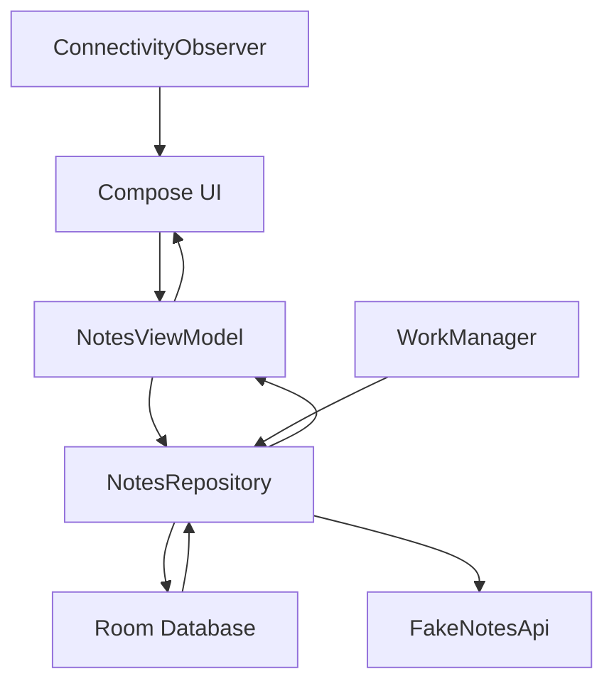

# Offline First System Design Android Demo

Educational Android demo app for learning offline-first system design.

The app is a small Field Notes tool built with Kotlin, Jetpack Compose, Room, Flow, WorkManager, and a fake remote API. It is intentionally implemented through micro milestones so each architectural idea can be reviewed in Git history and in `docs/learning/`.

## What The App Demonstrates

- Local database as the source of truth.
- Local writes before network sync.
- Visible sync status.
- Pending create, update, and delete operations.
- Manual sync.
- Background sync with WorkManager.
- Tombstones for offline deletes.
- Fake remote API.
- Conflict detection.
- Conflict resolution.
- Connectivity awareness.
- Debug sync log.
- Fast unit tests for offline-first behavior.

## Architecture



The key rule is simple:

The UI observes local state. Sync updates local state.

## Demo Flow

1. Create a note.
2. See it marked as `Pending create`.
3. Tap `Sync now`.
4. See it become `Synced`.
5. Edit the note.
6. See it become `Pending update`.
7. Open `Remote` and edit the fake server copy.
8. Open `Notes`, edit the same local note differently, and save.
9. Open `Sync`, tap `Sync pending changes`, and review conflict behavior.
10. Choose `Keep local` or `Use remote`.
11. Delete a synced note and observe tombstone-driven sync behavior.

## Milestone Docs

Learning notes live in `docs/learning/`.

Each milestone includes:

- Goal.
- What changed.
- Why it matters.
- Possible solutions.
- Advantages and disadvantages.
- Simple diagram.
- Android best practices.
- Verification.
- Junior, mid-level, senior, and architect interview questions.

## Verification

Run:

```bash
./gradlew testDebugUnitTest
```

## Git History

Each milestone is committed separately:

```text
m1  document roadmap and agent requirements
m2  build baseline field notes shell
m3  introduce notes ui state and viewmodel
m4  persist notes with room source of truth
m5  track local write sync status
m6  add fake remote notes api
m7  add manual notes sync
m8  schedule background sync with workmanager
m9  support deletes with tombstones
m10 detect note sync conflicts
m11 add conflict resolution controls
m12 show connectivity awareness
m13 add offline first behavior tests
m14 add sync debug log
m15 final polish and architecture review
```
