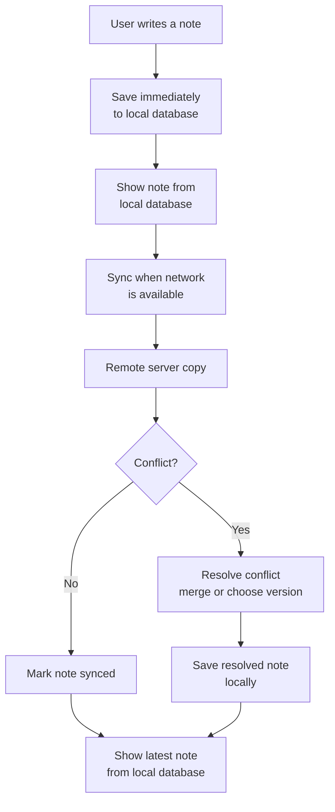
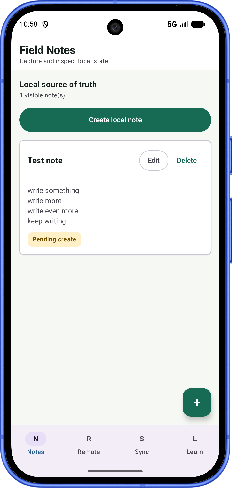
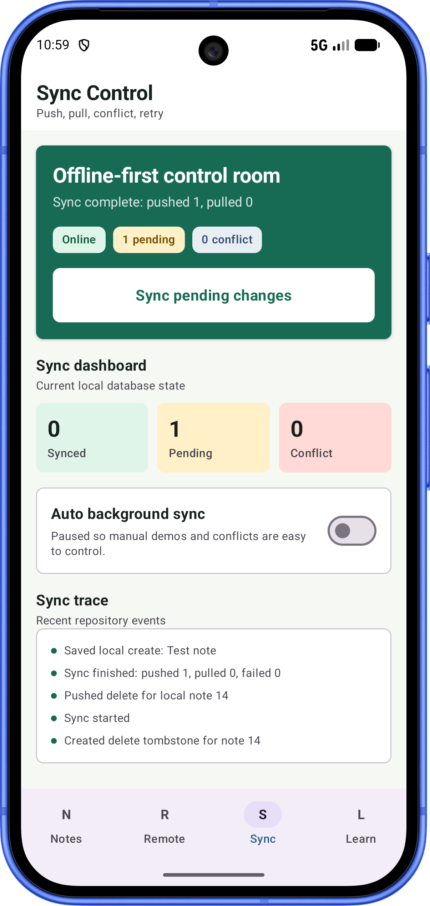
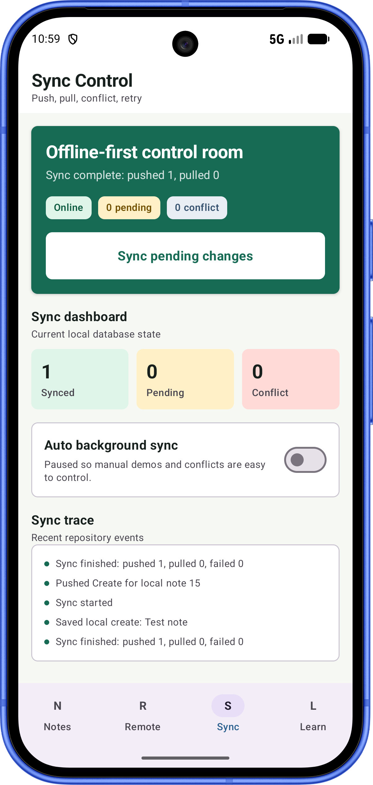
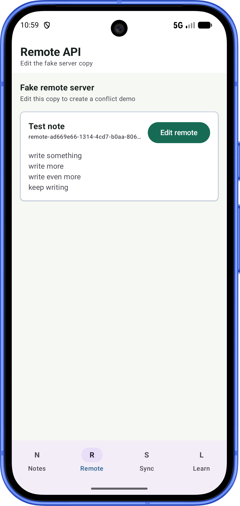
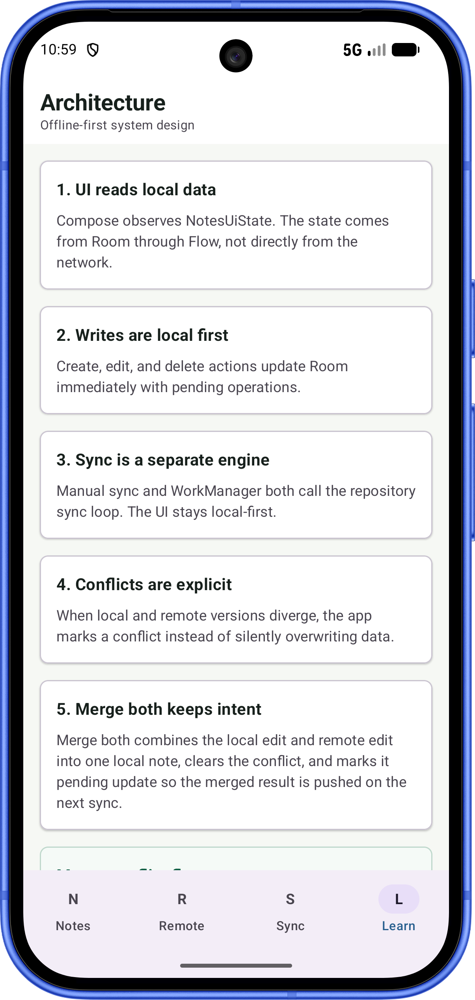
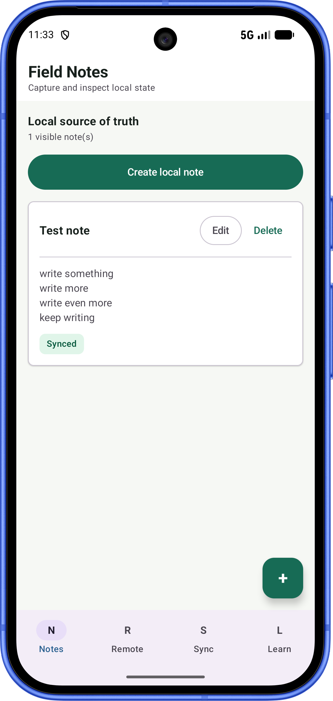

# Offline First System Design Android Demo

Educational Android demo app for learning offline-first system design.

The app is a small Field Notes tool built with Kotlin, Jetpack Compose, Room, Flow, WorkManager, Hilt, and a fake remote API. It is intentionally implemented through micro milestones so each architectural idea can be reviewed in Git history and in `docs/learning/`.

## What The App Demonstrates

- Local database as the source of truth.
- Hilt dependency injection instead of a manual app container.
- Local writes before network sync.
- Visible sync status.
- Pending create, update, and delete operations.
- Manual sync.
- Background sync with WorkManager.
- Auto sync that queues existing pending notes when enabled.
- Tombstones for offline deletes.
- Fake remote API.
- Conflict detection.
- Conflict resolution with keep local, use remote, and merge both.
- Connectivity awareness.
- Dedicated create/edit note screen with a notes list and floating action button.
- Delete confirmation before removing a note.
- Debug sync log.
- Serialized sync with a Kotlin `Mutex` so manual sync and background sync do not race.
- Fast unit tests for offline-first behavior.

## Architecture



The key rule is simple:

The app saves first, shows local data immediately, and syncs later when the network is available.

## Package Structure

```text
com.venkatsvision.offlinefirstsystemdesign
+-- data
|   +-- connectivity   # Online/offline observer
|   +-- local          # Room database, DAO, entities
|   +-- remote         # Fake remote API and remote models
|   +-- sync           # WorkManager worker and sync scheduler
+-- di                 # Hilt modules and dependency bindings
+-- domain             # App models, repository contract, sync states
+-- ui
    +-- notes          # Compose screens, route, ViewModel, UI events/state
    +-- theme          # Compose Material theme
```

Main idea:

- `ui` renders state and sends user events.
- `domain` defines stable app concepts.
- `data` implements storage, fake remote, connectivity, and sync.
- `di` wires dependencies with Hilt.

## Screenshots

<p>
  
  
  
  
  
  
</p>

## Demo Flow

1. Open `Notes` and tap `Create local note` or the `+` floating action button.
2. Save the note from the dedicated editor screen.
3. See it marked as `Pending create`.
4. Tap `Sync pending changes`.
5. See it become `Synced`.
6. Edit the note.
7. See it become `Pending update`.
8. Open `Remote` and edit the fake server copy.
9. Open `Notes`, edit the same local note differently, and save.
10. Open `Sync`, tap `Sync pending changes`, and review conflict behavior.
11. Choose `Merge both` to combine local and remote text, or choose `Keep local` / `Use remote` to compare strategies.
12. Enable auto sync and create/edit a pending note. WorkManager queues one-time sync work that waits for network if needed.
13. Delete a synced note, confirm deletion, and observe tombstone-driven sync behavior.

## Auto Sync Behavior

Auto sync is not a timer in this project.

- The app schedules one-time WorkManager work.
- The work has a `NetworkType.CONNECTED` constraint.
- If network is unavailable, WorkManager waits.
- When network is available, Android can run the queued sync.
- If auto sync is turned on while syncable pending notes already exist, the app queues work immediately.
- Conflict notes are not auto-synced until the user resolves the conflict.

## What's Missing In This Demo

This app is for learning. It shows the main offline-first ideas, but it is still smaller than a real production app.

Not included:

- **Real server calls.** The app uses an in-memory fake API, not Retrofit/Ktor or HTTP.
- **Persistent fake server.** The fake remote data is lost when the app process restarts.
- **Deletes from another device.** Local deletes are synced to remote, but remote deletes are not pulled back to local.
- **Multiple users or devices.** The demo does not show two real devices syncing the same account.
- **Login and permissions.** There is no authentication, user account, or token handling.
- **Advanced conflict merging.** Conflicts are resolved at the whole-note level. A real collaborative editor may need field-level merges, operation logs, CRDTs, or OT.
- **Periodic sync.** Sync runs from a manual tap or one-time WorkManager work. There is no periodic sync, foreground refresh, push notification, or WebSocket trigger.
- **Large data sets.** The app reads all notes as one list. A real app may need paging.
- **Encryption.** The Room database is plain SQLite.
- **Safe schema migrations.** The demo uses destructive migration, which can wipe local data during a schema change.
- **Production monitoring.** The app has a local debug sync log, but no crash reporting, metrics, or remote logs.

Known remaining gaps:

- The fake API does not support compare-and-swap, ETags, or server-side version checks. Two writers can still race in ways a real backend should prevent.
- Error handling is simple. A production app would need clearer retry rules and better user-facing failure states.

## Milestone Docs

Learning notes live in `docs/learning/`.

Each milestone includes:

- Goal.
- What changed.
- Why it matters.
- Possible solutions.
- Advantages and disadvantages.
- Simple diagram.
- Android best practices.
- Verification.
- Junior, mid-level, senior, and architect interview questions.

## Verification

Run:

```bash
./gradlew testDebugUnitTest
```

## Git History

Each milestone is committed separately:

```text
m1  document roadmap and agent requirements
m2  build baseline field notes shell
m3  introduce notes ui state and viewmodel
m4  persist notes with room source of truth
m5  track local write sync status
m6  add fake remote notes api
m7  add manual notes sync
m8  schedule background sync with workmanager
m9  support deletes with tombstones
m10 detect note sync conflicts
m11 add conflict resolution controls
m12 show connectivity awareness
m13 add offline first behavior tests
m14 add sync debug log
m15 final polish and architecture review
post-m15 polish: dedicated editor flow, merge-both conflict resolution, auto-sync pending queue, delete confirmation
m16 replace manual dependency container with Hilt
```
