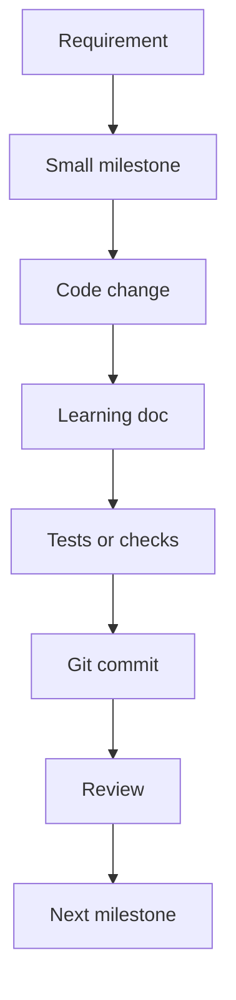

# M1: Document Requirements And Roadmap

## Goal

Create a clear learning contract before writing app code.

This milestone explains what we are building, why offline-first matters, and how future milestones should be reviewed.

## What Changed

- Added `agent.md` to remember the project requirements.
- Added `roadmap.md` to break the app into small milestones.
- Created `docs/learning/` for milestone learning notes.

No Android feature code was changed in this milestone.

## Why This Matters For Offline-First Design

Offline-first apps have more moving parts than simple online-only apps. If we start coding without a plan, sync logic can become hard to understand.

This milestone creates the map first:

- What the app should teach.
- Which architecture direction we will use.
- Which tradeoffs should be explained.
- How each milestone should be documented and committed.

Current app note:

The roadmap now includes post-M15 refinements: dedicated editor flow, Remote screen conflict demos, merge-both resolution, auto-sync queueing, WorkManager network constraints, delete confirmation, and `Mutex`-protected sync.

## Possible Solutions

### Solution 1: Build The Whole App First

Build all features first, then document at the end.

Advantages:

- Faster if the only goal is a working demo.
- Fewer pauses between implementation steps.

Disadvantages:

- Harder to learn one concept at a time.
- Review becomes overwhelming.
- Architecture decisions are hidden inside finished code.

### Solution 2: Build In Micro Milestones

Build one small concept at a time and document it.

Advantages:

- Easier to review.
- Easier to learn.
- Git history becomes a teaching tool.
- Mistakes are easier to isolate and fix.

Disadvantages:

- Takes more discipline.
- Some early milestones may look too simple.
- Documentation work is required throughout the project.

Chosen approach: micro milestones.

## Simple Diagram

## Key Android Best Practices

- Plan the app architecture before adding persistence and sync.
- Keep UI, domain logic, local storage, and remote sync separate.
- Make the local database the source of truth in future milestones.
- Use small commits so each architectural step is easy to inspect.
- Add tests as soon as behavior becomes meaningful.

## Testing Or Verification

For this documentation milestone:

- Verified that `agent.md` exists.
- Verified that `roadmap.md` exists.
- Verified that `docs/learning/` exists.

No Gradle test was required because no app code changed.

## Junior Interview Questions

1. What does offline-first mean in a mobile app?
2. Why is it useful to split a project into small milestones?
3. What is a local database used for in an offline-first app?
4. Why should users see sync status?
5. What is the difference between app UI and app data?

## Mid-Level Interview Questions

1. Why should the UI read from the local database instead of directly from the network?
2. What problems can happen if user writes are only sent directly to the server?
3. What is the repository pattern?
4. How can Git history help explain architecture decisions?
5. What are the tradeoffs of starting with a fake API?

## Senior Interview Questions

1. How would you model pending local operations for create, update, and delete?
2. What can go wrong when network state changes during a sync?
3. Why is conflict handling a product decision as much as a technical decision?
4. How would you make sync logic testable?
5. What should be logged or exposed to debug an offline-first app?
6. Why should advanced concepts like `Mutex` and WorkManager constraints be explained in learning docs?

## Architect Interview Questions

1. When would you choose offline-first over network-first?
2. How would you design sync boundaries between mobile clients and backend services?
3. How would you handle idempotency for repeated mobile sync requests?
4. What conflict resolution strategy would you choose for collaborative editing?
5. How would your design change for millions of users and multiple devices per user?
6. How would you keep architecture documentation accurate as the implementation evolves?
