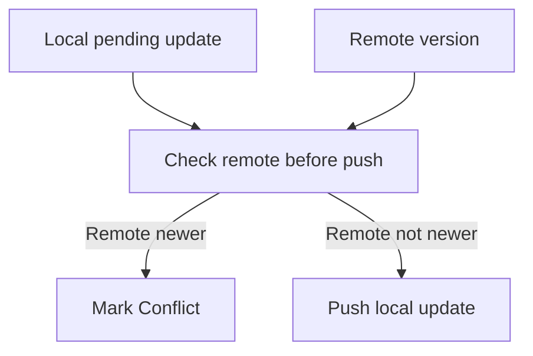

# M10: Conflict Detection

## Goal

Detect when local and remote versions of the same note both changed.

This milestone marks a note as `Conflict detected` instead of silently overwriting remote data.

## What Changed

- Added `SyncStatus.Conflict`.
- Added remote ID to the domain model.
- Added conflict title/body fields.
- Added conflict metadata to Room.
- Added a visible Remote screen so the fake server copy can be edited directly.
- Sync now checks the remote version before pushing a local update.
- If remote is newer than the local pending update, the local note becomes a conflict.

## Why This Matters For Offline-First Design

Offline-first apps can have multiple copies of the same data:

- Local copy on this device.
- Remote copy on the server.
- Local copy on another device.

If two copies change independently, blindly overwriting one version can cause data loss.

Conflict detection is the first safety step. Resolution comes next.

## Possible Solutions

### Solution 1: Last Write Wins

Whichever version has the newest timestamp wins automatically.

Advantages:

- Simple.
- No user interaction needed.
- Good for low-value data.

Disadvantages:

- Can lose user work.
- Hard to explain when important text disappears.

### Solution 2: Detect Conflict And Ask Later

Mark the record as conflicted and show both versions.

Advantages:

- Avoids silent data loss.
- Teaches users what happened.
- Prepares for manual merge.

Disadvantages:

- More UI complexity.
- Requires a resolution flow.

### Solution 3: Automatic Merge

Try to merge local and remote changes automatically.

Advantages:

- Better for collaborative editing.
- Reduces user decisions.

Disadvantages:

- Hard for free-form text.
- Merge mistakes can be worse than asking the user.

Chosen approach: detect conflict and defer resolution to M11.

## Simple Diagram



## Key Android Best Practices

- Never silently overwrite data when conflict is possible.
- Store conflict metadata locally so it survives process death.
- Keep conflict detection in the repository/sync layer.
- Make conflict scenarios repeatable for education and testing with visible local and remote copies.
- Keep conflict resolution separate from conflict detection.

## Testing Or Verification

Verified with:

```bash
./gradlew testDebugUnitTest
```

Result:

- Build successful.
- Existing sync and ViewModel tests successful.

## Junior Interview Questions

1. What is a sync conflict?
2. Why can two versions of a note exist?
3. What does last write wins mean?
4. Why can last write wins be dangerous?
5. Why store conflict information locally?

## Mid-Level Interview Questions

1. Why check remote before pushing a pending local update?
2. What metadata helps detect conflicts?
3. Why is conflict detection different from conflict resolution?
4. How can timestamps be unreliable?
5. What UX problems happen when conflicts are hidden?

## Senior Interview Questions

1. How would you improve conflict detection beyond timestamps?
2. What is a version vector?
3. How would you handle conflicts for structured fields versus free text?
4. How should sync behave after a note enters conflict state?
5. What tests would prove conflict detection is correct?

## Architect Interview Questions

1. How should backend APIs expose versions for offline clients?
2. When is automatic conflict resolution acceptable?
3. How would you design conflict detection across multiple devices?
4. What data types need CRDTs or operational transforms?
5. How do product requirements shape conflict strategy?
