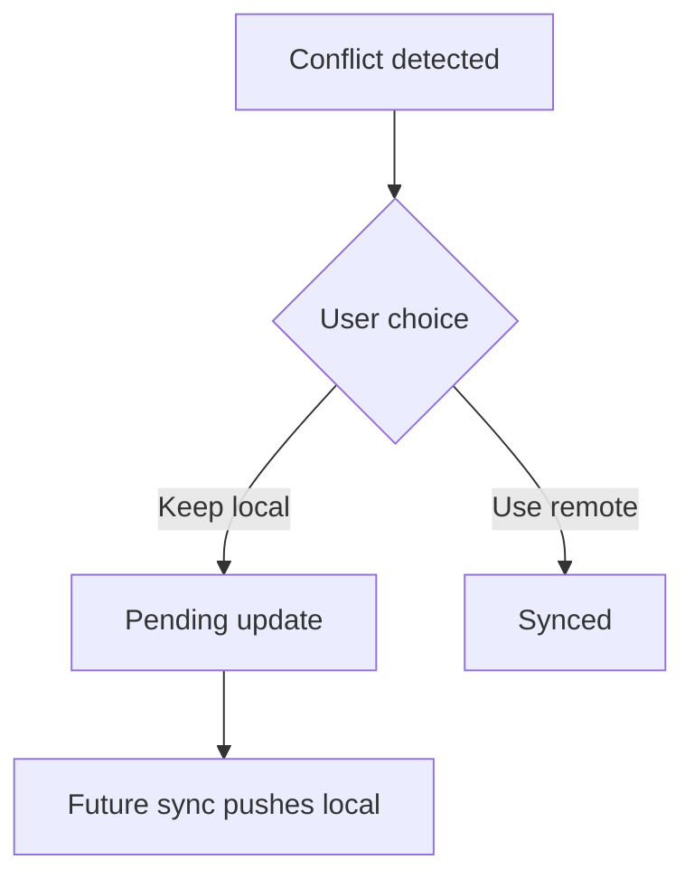

# M11: Conflict Resolution UI

## Goal

Let users resolve detected conflicts by choosing the local or remote version.

This milestone turns conflict detection into an actionable flow.

## What Changed

- Added `ConflictResolution`.
- Added `resolveConflict()` to the repository contract.
- Added repository logic for `KeepLocal` and `UseRemote`.
- Added UI buttons for conflict notes.
- Added ViewModel events for conflict resolution.
- Added tests for both resolution paths.

## Why This Matters For Offline-First Design

Detecting a conflict is only half the job. The app must decide what happens next.

For a notes app, silent overwrite is risky because text can be important. A user-visible choice is safer:

- Keep local: local version remains and will sync again.
- Use remote: remote version replaces local and becomes synced.

## Possible Solutions

### Solution 1: Always Keep Local

Local device changes win automatically.

Advantages:

- Simple.
- User work on this device is protected.

Disadvantages:

- Can overwrite newer remote work.
- Bad for multi-device collaboration.

### Solution 2: Always Use Remote

Remote server changes win automatically.

Advantages:

- Keeps clients aligned with server state.
- Simple from backend perspective.

Disadvantages:

- Can discard offline user work.
- Users may lose trust.

### Solution 3: Ask The User

Show both versions and let the user choose.

Advantages:

- Avoids silent data loss.
- Good for human-authored content.
- Easy to understand for this demo.

Disadvantages:

- Adds UI complexity.
- Can interrupt users.
- Not ideal for high-volume conflicts.

Chosen approach: ask the user.

## Simple Diagram



## Key Android Best Practices

- Keep conflict resolution in the repository/data layer.
- Keep composables focused on displaying choices.
- Preserve local and remote versions until resolution.
- Schedule sync when the user keeps local.
- Add tests for state transitions.

## Testing Or Verification

Verified with:

```bash
./gradlew testDebugUnitTest
```

Result:

- Build successful.
- Keep-local conflict test successful.
- Use-remote conflict test successful.

## Junior Interview Questions

1. What does it mean to resolve a conflict?
2. What happens when the user keeps local?
3. What happens when the user uses remote?
4. Why should the app show both versions?
5. Why is silent overwrite risky?

## Mid-Level Interview Questions

1. Why does keep-local become a pending update?
2. Why does use-remote become synced immediately?
3. What UI information helps users choose correctly?
4. How would you handle accidental resolution?
5. Why should resolution clear conflict metadata?

## Senior Interview Questions

1. How would you support manual merge instead of two buttons?
2. How should conflict resolution be audited?
3. What happens if remote changes again during resolution?
4. How would you design undo for conflict resolution?
5. How would you test conflict resolution across process death?

## Architect Interview Questions

1. Which products should avoid user-facing conflict resolution?
2. How would backend versioning support safe conflict resolution?
3. When would you use CRDTs instead of manual resolution?
4. How should conflict UX differ for notes, inventory, chat, and banking?
5. How would you measure conflict frequency in production?

