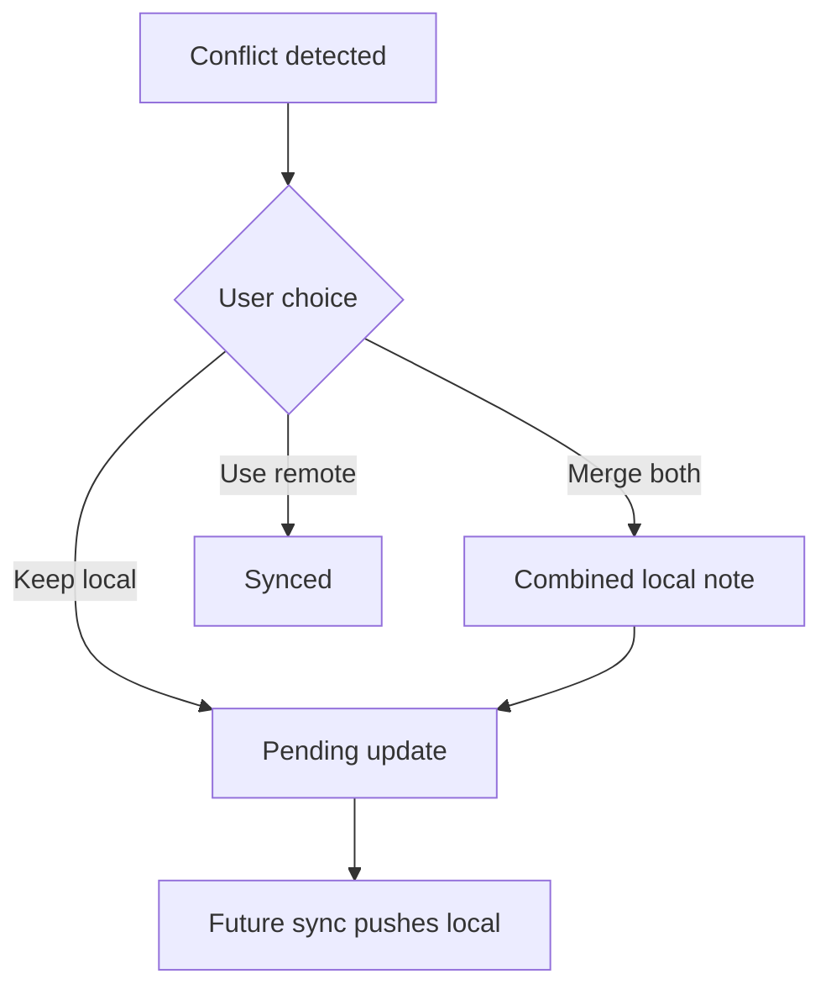

# M11: Conflict Resolution UI

## Goal

Let users resolve detected conflicts by choosing the local version, the remote version, or a merged version.

This milestone turns conflict detection into an actionable flow.

## What Changed

- Added `ConflictResolution`.
- Added `resolveConflict()` to the repository contract.
- Added repository logic for `KeepLocal`, `UseRemote`, and `MergeBoth`.
- Added UI buttons for conflict notes.
- Added ViewModel events for conflict resolution.
- Added tests for conflict resolution paths.
- Added a Remote screen where the fake server copy can be edited directly for demos.

## Why This Matters For Offline-First Design

Detecting a conflict is only half the job. The app must decide what happens next.

For a notes app, silent overwrite is risky because text can be important. A user-visible choice is safer:

- Keep local: local version remains and will sync again.
- Use remote: remote version replaces local and becomes synced.
- Merge both: local and remote text are combined into one local note, then pushed on the next sync.

## Possible Solutions

### Solution 1: Always Keep Local

Local device changes win automatically.

Advantages:

- Simple.
- User work on this device is protected.

Disadvantages:

- Can overwrite newer remote work.
- Bad for multi-device collaboration.

### Solution 2: Always Use Remote

Remote server changes win automatically.

Advantages:

- Keeps clients aligned with server state.
- Simple from backend perspective.

Disadvantages:

- Can discard offline user work.
- Users may lose trust.

### Solution 3: Ask The User

Show both versions and let the user choose.

Advantages:

- Avoids silent data loss.
- Good for human-authored content.
- Easy to understand for this demo.

Disadvantages:

- Adds UI complexity.
- Can interrupt users.
- Not ideal for high-volume conflicts.

Chosen approach: ask the user.

### Solution 4: Merge Both Into One Note

Combine the local and remote text into one local note.

Advantages:

- Preserves both sides of the conflict.
- Good for demos and note-like text.
- Reduces fear of losing user work.

Disadvantages:

- The merged text may need cleanup.
- Not suitable for all data types.
- Still needs a future sync to push the merged result.

Chosen demo path: merge both. Keep local and use remote remain available to compare tradeoffs.

## Simple Diagram



## Key Android Best Practices

- Keep conflict resolution in the repository/data layer.
- Keep composables focused on displaying choices.
- Preserve local and remote versions until resolution.
- Schedule sync when the user keeps local or merges both.
- Add tests for state transitions.
- Keep conflict demo steps visible: edit remote copy, edit local copy, sync, resolve.

## Testing Or Verification

Verified with:

```bash
./gradlew testDebugUnitTest
```

Result:

- Build successful.
- Keep-local conflict test successful.
- Use-remote conflict test successful.
- Merge-both conflict behavior successful.

## Junior Interview Questions

1. What does it mean to resolve a conflict?
2. What happens when the user keeps local?
3. What happens when the user uses remote?
4. What happens when the user taps merge both?
5. Why should the app show both versions?
6. Why is silent overwrite risky?

## Mid-Level Interview Questions

1. Why does keep-local become a pending update?
2. Why does use-remote become synced immediately?
3. Why does merge-both become a pending update?
4. What UI information helps users choose correctly?
5. How would you handle accidental resolution?
6. Why should resolution clear conflict metadata?

## Senior Interview Questions

1. How would you support a richer manual merge editor?
2. How should conflict resolution be audited?
3. What happens if remote changes again during resolution?
4. How would you design undo for conflict resolution?
5. How would you test conflict resolution across process death?
6. How would merge-both change for structured data instead of free text?

## Architect Interview Questions

1. Which products should avoid user-facing conflict resolution?
2. How would backend versioning support safe conflict resolution?
3. When would you use CRDTs instead of manual resolution?
4. How should conflict UX differ for notes, inventory, chat, and banking?
5. How would you measure conflict frequency in production?
6. How would product requirements decide between merge-both, keep-local, and server-authoritative resolution?
