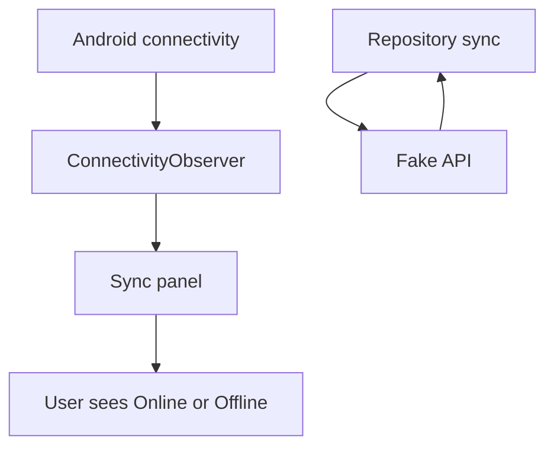

# M12: Connectivity Awareness

## Goal

Show online/offline state while keeping Room as the source of truth.

This milestone adds a connectivity observer and displays network status in the sync panel.

## What Changed

- Added `ConnectivityObserver`.
- Added `AndroidConnectivityObserver`.
- Added `ACCESS_NETWORK_STATE` permission.
- Added connectivity state to `FieldNotesRoute`.
- Displayed `Online` or `Offline` in the sync panel.

## Why This Matters For Offline-First Design

Connectivity can help users understand why sync may wait or fail.

But connectivity is only a hint:

- A device can be connected to Wi-Fi with no real internet.
- Captive portals can block requests.
- Servers can fail while the device is online.
- The network can drop between the connectivity check and the API call.

So the app still saves locally first and handles sync errors directly.

## Possible Solutions

### Solution 1: Ignore Connectivity

Do not show online/offline status.

Advantages:

- Simpler UI.
- Fewer platform APIs.

Disadvantages:

- Users may not understand why sync waits.
- Harder to debug sync behavior.

### Solution 2: Use Connectivity As A Hint

Display online/offline state, but still handle every network call defensively.

Advantages:

- Helpful user feedback.
- Keeps architecture honest.
- Works well with WorkManager constraints.

Disadvantages:

- Can still be wrong.
- Requires careful wording.

### Solution 3: Block All Sync When Offline Flag Is False

Only sync if connectivity observer says online.

Advantages:

- Avoids obvious failed calls.

Disadvantages:

- Connectivity state can be stale.
- Can block valid requests.
- Still does not replace error handling.

Chosen approach: use connectivity as a hint.

## Simple Diagram



Connectivity informs the UI. Repository sync still handles real success or failure.

## Key Android Best Practices

- Use `ConnectivityManager` for network state.
- Request `ACCESS_NETWORK_STATE`.
- Treat network state as advisory.
- Keep connectivity display outside persistence logic.
- Continue handling sync exceptions.

## Testing Or Verification

Verified with:

```bash
./gradlew testDebugUnitTest
```

Result:

- Build successful.
- Manifest and connectivity observer compiled.
- Existing tests successful.

## Junior Interview Questions

1. What does online/offline status mean?
2. Why can an app save notes while offline?
3. What permission is needed to read network state?
4. Why is connectivity only a hint?
5. What should happen if sync fails while online?

## Mid-Level Interview Questions

1. Why should network calls still use try/catch?
2. What is a captive portal?
3. How does WorkManager use network constraints?
4. Why should connectivity not decide local data visibility?
5. Where should connectivity state live in this app?

## Senior Interview Questions

1. How would you test connectivity changes?
2. What race conditions exist between connectivity callbacks and sync?
3. How should UI copy explain offline status?
4. How would you design connectivity for multi-network devices?
5. How would you avoid over-triggering sync on network changes?

## Architect Interview Questions

1. How should mobile apps behave on unreliable networks?
2. What is the difference between reachability and service availability?
3. How would backend health influence mobile sync decisions?
4. How would you design observability for network-related sync failures?
5. How would the strategy change for critical workflows?

