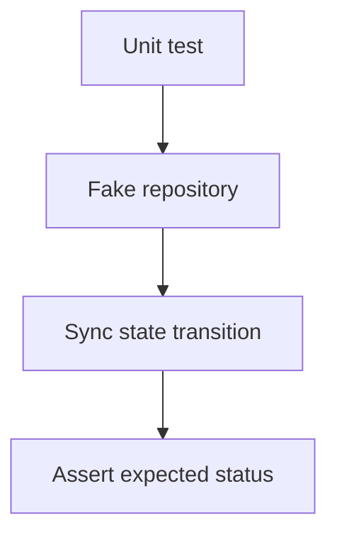

# M13: Testing Offline-First Behavior

## Goal

Prove important offline-first behavior with fast tests.

This milestone adds tests that document the expected state transitions for local writes and sync.

## What Changed

- Added `OfflineFirstBehaviorTest`.
- Tested local create as `PendingCreate`.
- Tested synced note edit as `PendingUpdate`.
- Tested sync clearing pending operations.
- Tested local delete behavior.
- Tested that enabling auto sync with existing pending notes queues background sync.
- Tested conflict resolution paths including merge-both behavior.

## Why This Matters For Offline-First Design

Offline-first apps rely on state transitions. Bugs often happen when a record is in the wrong state:

- A pending create accidentally becomes synced.
- A pending update loses its remote ID.
- A delete removes metadata before remote sync.
- A failed sync hides user work.
- Auto sync is enabled but old pending work never gets queued.
- A conflict record is pushed before the user resolves it.

Tests make those expectations visible.

## Possible Solutions

### Solution 1: Only Manual Testing

Tap through the app and inspect behavior by hand.

Advantages:

- Good for UI confidence.
- Easy to start.

Disadvantages:

- Slow.
- Easy to miss edge cases.
- Hard to repeat exactly.

### Solution 2: Fast Unit Tests With Fakes

Test state transitions using fake repositories and fake APIs.

Advantages:

- Fast.
- Deterministic.
- Good for business rules.
- Runs without emulator.

Disadvantages:

- Does not prove Room SQL behavior.
- Does not prove Android OS behavior.

### Solution 3: Instrumentation And End-To-End Tests

Run tests on an emulator or device with real Room and Android components.

Advantages:

- More realistic.
- Catches platform integration issues.

Disadvantages:

- Slower.
- More setup.
- Can be flaky if overused.

Chosen approach for this milestone: add fast unit tests and keep room for future instrumentation tests.

## Simple Diagram



## Key Android Best Practices

- Test state transitions close to the business logic.
- Use fakes for deterministic offline scenarios.
- Keep emulator tests for platform integration.
- Test pending create, pending update, sync success, and delete behavior.
- Test auto-sync scheduling decisions separately from WorkManager OS execution.
- Test conflict resolution state transitions as business rules.
- Treat tests as executable documentation.

## Testing Or Verification

Verified with:

```bash
./gradlew testDebugUnitTest
```

Result:

- Build successful.
- New offline-first behavior tests successful.
- Existing ViewModel, fake API, and sync tests successful.
- Auto-sync pending queue regression test successful.

## Junior Interview Questions

1. Why do we write tests for offline behavior?
2. What is a fake repository?
3. What does deterministic mean?
4. Why are unit tests faster than emulator tests?
5. What does a pending create test prove?
6. Why should a test cover enabling auto sync after a note is already pending?

## Mid-Level Interview Questions

1. What should be tested with fakes?
2. What should be tested with instrumentation tests?
3. Why are state transition tests useful for sync?
4. How would you test failed sync retry?
5. Why should tests avoid real network calls?
6. Why test scheduling intent separately from actual WorkManager execution?

## Senior Interview Questions

1. How would you test Room DAO behavior?
2. How would you test WorkManager workers?
3. What sync cases need property-based testing?
4. How would you test conflicts across multiple clients?
5. How would you prevent flaky offline-first tests?
6. How would you test that a `Mutex` prevents concurrent duplicate sync pushes?

## Architect Interview Questions

1. What test pyramid would you use for an offline-first app?
2. How would you design contract tests between mobile and backend?
3. Which offline guarantees should be part of release gates?
4. How would you test data migrations for a large user base?
5. How would observability complement automated tests?
6. Which sync invariants should never be allowed to regress?
