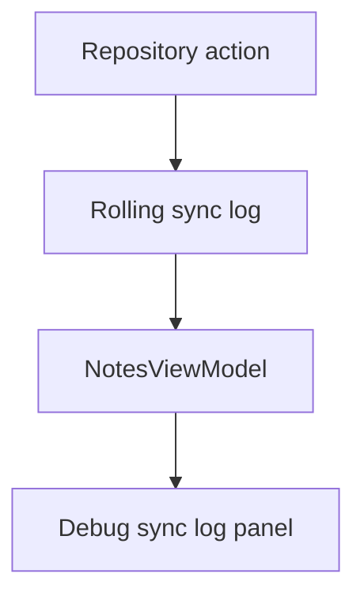

# M14: Observability And Debug Tools

## Goal

Make sync behavior easier to inspect while learning.

This milestone adds a small debug sync log that records local writes, sync attempts, pulls, conflicts, and deletes.

Recent polish also makes the log useful for advanced demos: it can show when sync is skipped because another sync is already running, when a remote copy is edited, and when conflict resolution creates a pending merged note.

## What Changed

- Added `syncLog` to `NotesRepository`.
- Added an in-memory rolling log in `RoomNotesRepository`.
- Added fake repository log support.
- Added log collection in `NotesViewModel`.
- Added a compact `Debug sync log` panel in the UI.
- Added a unit test for log behavior.
- Current implementation logs important advanced events such as concurrent sync skip, remote edit, conflict resolution, and sync completion.

## Why This Matters For Offline-First Design

Offline-first bugs can be hard to understand because work happens across time:

- The user writes locally now.
- Sync may run later.
- Retry may happen after failure.
- Pull may happen after push.
- Conflicts can appear after remote changes.
- A `Mutex` may skip a duplicate sync request while one sync is already running.
- WorkManager may run later after network becomes available.

A debug log makes the flow visible.

## Possible Solutions

### Solution 1: Only Use Logcat

Write logs with Android logging APIs.

Advantages:

- Familiar for Android developers.
- Does not add UI.

Disadvantages:

- Hard for learners using the app.
- Logs disappear into developer tooling.
- Not user-visible.

### Solution 2: In-App Debug Log

Show recent sync events inside the app.

Advantages:

- Great for education.
- Easy to inspect during demos.
- Makes sync state transitions visible.

Disadvantages:

- Not production telemetry.
- Should be hidden or guarded in real apps.

### Solution 3: Production Observability Pipeline

Send metrics, traces, and structured logs to monitoring tools.

Advantages:

- Useful at scale.
- Helps debug real user problems.

Disadvantages:

- Too heavy for this educational milestone.
- Requires privacy, sampling, and backend setup.

Chosen approach: in-app debug log.

## Simple Diagram



## Key Android Best Practices

- Keep debug state separate from durable app data.
- Avoid putting debug-only behavior into core UI logic.
- Limit log size.
- Do not log sensitive user data in production.
- Use observability to support tests and manual review.
- Log concurrency decisions in simple words, such as "another sync is already running".
- Keep demo logs understandable for learners.

## Testing Or Verification

Verified with:

```bash
./gradlew testDebugUnitTest
```

Result:

- Build successful.
- Sync log test successful.
- Existing offline-first tests successful.

## Junior Interview Questions

1. What is observability?
2. Why is sync hard to debug?
3. What is a debug log?
4. Why limit the number of log entries?
5. Why should sensitive data not be logged?
6. What log message would help explain a skipped sync?

## Mid-Level Interview Questions

1. What should a sync log include?
2. What is the difference between user-facing status and debug logs?
3. Why keep logs out of Room in this demo?
4. How can logs help test failures?
5. When should debug UI be hidden?
6. How can logs help explain WorkManager waiting for network?

## Senior Interview Questions

1. What production metrics would you add for sync?
2. How would you correlate mobile sync logs with backend logs?
3. How would you sample high-volume sync telemetry?
4. How would you debug a partial sync failure?
5. What privacy risks exist in observability?
6. What telemetry would prove the `Mutex` is preventing duplicate sync work?

## Architect Interview Questions

1. What observability is required before launching offline sync broadly?
2. How would you design sync tracing across client and server?
3. Which sync SLOs would you define?
4. How would support teams diagnose stuck pending operations?
5. How would observability influence backend API design?
6. How would you detect a fleet-wide problem where WorkManager jobs are queued but not completing?
