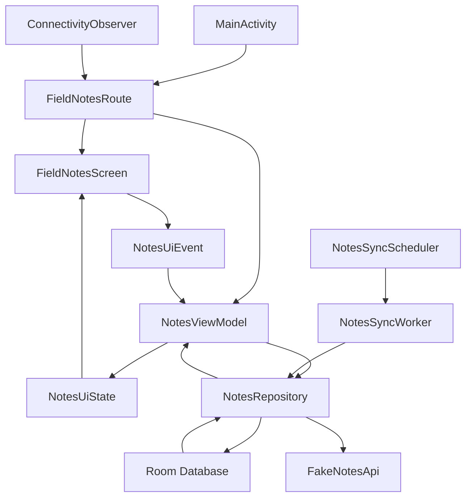
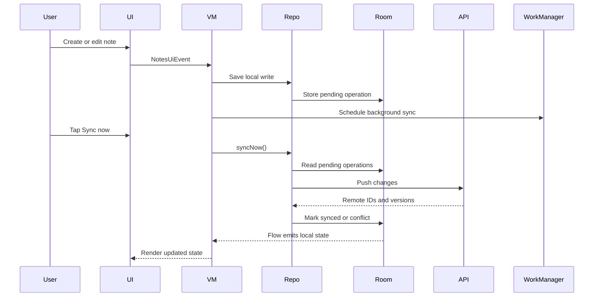

# M15: Final Polish And Architecture Review

## Goal

Review the completed offline-first demo as a system design case study.

This milestone adds final project documentation and summarizes the architecture, tradeoffs, and next production steps.

## What Changed

- Added `README.md`.
- Added final architecture review.
- Documented the demo flow.
- Updated the roadmap to mark the project complete.

## Final Architecture



## Why This Matters For Offline-First Design

The final app follows the main offline-first rule:

The UI reads local state. The network only changes local state through sync.

This makes the app useful even when sync is delayed, flaky, or unavailable.

## Possible Solutions Reviewed

### Network-First

The app calls the server directly from the UI or repository and renders server responses.

Advantages:

- Simple for always-online apps.
- Fewer local state transitions.

Disadvantages:

- Poor offline experience.
- Failed writes block users.
- Harder to support background retry.

### Cache-Aside

The app fetches remote data and stores a cache for faster reads.

Advantages:

- Better than network-only.
- Useful for read-heavy apps.

Disadvantages:

- Offline writes are still awkward.
- Cache invalidation can become confusing.

### Offline-First

The app saves locally first and syncs later.

Advantages:

- Best for unreliable networks.
- Good user trust.
- Supports retry, background sync, and conflict handling.

Disadvantages:

- More state modeling.
- More tests needed.
- Backend APIs need stronger guarantees.

Chosen approach: offline-first.

## Production Gaps To Discuss

This demo is educational. A production app should also consider:

- Real backend API.
- Idempotency keys for creates and deletes.
- Auth.
- Encrypted local storage if data is sensitive.
- Real schema migrations instead of destructive migration.
- Structured telemetry.
- More complete WorkManager tests.
- DAO and repository instrumentation tests.
- Multi-device conflict tests.
- Accessibility and UI polish.
- Privacy-safe logging.

## Simple Final Sync Diagram



## Key Android Best Practices

- Keep Activity small.
- Use Compose for UI.
- Use ViewModel for screen state.
- Use immutable UI state.
- Use explicit UI events.
- Use Room as local source of truth.
- Use repository boundaries.
- Use WorkManager for durable background sync.
- Use Flow for reactive local data.
- Use fake implementations for fast tests.

## Testing Or Verification

Verified with:

```bash
./gradlew testDebugUnitTest
```

Expected result:

- Build successful.
- All unit tests pass.

## Junior Interview Questions

1. What does offline-first mean?
2. Why does the app save notes locally first?
3. What is Room used for?
4. What is WorkManager used for?
5. What does sync status tell the user?

## Mid-Level Interview Questions

1. Why should the UI read from Room instead of directly from the API?
2. What is the repository pattern doing in this app?
3. Why are pending operations stored in the database?
4. What is a tombstone?
5. Why is connectivity only a hint?

## Senior Interview Questions

1. How would you make create and delete sync idempotent?
2. How would you replace the fake API with Retrofit?
3. How would you write Room migration tests?
4. How would you handle sync while the user is editing the same note?
5. How would you improve conflict detection beyond timestamps?

## Architect Interview Questions

1. What backend contracts are required for reliable offline-first sync?
2. How would the architecture change for multiple entity types?
3. How would you support multiple devices editing the same records?
4. What observability would you require before launch?
5. When would you reject offline-first as the wrong design?

