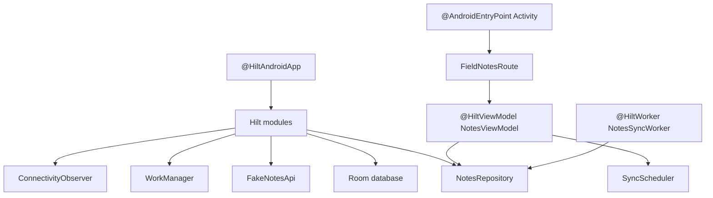

# M16: Dependency Injection With Hilt

## Goal

Use Dagger Hilt for dependency injection and remove manual dependency wiring boilerplate.

This milestone replaces the old `AppContainer`, custom ViewModel factory, and worker repository lookup with Hilt-managed dependencies.

## What Changed

- Added the Hilt Gradle plugin and Hilt dependencies.
- Added `OfflineFirstApplication` with `@HiltAndroidApp`.
- Added `@AndroidEntryPoint` to `MainActivity`.
- Added Hilt modules for Room, fake remote API, WorkManager, repository, connectivity, and sync scheduling.
- Converted `NotesViewModel` to `@HiltViewModel`.
- Converted `NotesSyncWorker` to `@HiltWorker`.
- Added a small `SyncScheduler` interface for testable background sync scheduling.
- Removed `AppContainer`.
- Removed the custom `ViewModelProvider.Factory`.

## Why This Matters For Offline-First Design

Offline-first apps have many long-lived dependencies:

- Room database.
- DAO objects.
- Repository.
- Fake or real remote API.
- Connectivity observer.
- WorkManager scheduler.
- Background workers.

Manual construction works at first, but it becomes noisy as the app grows. Hilt centralizes object creation and lets Android classes receive dependencies safely.

The important design rule stays the same:

The UI reads local state. Sync updates local state. Hilt only creates and connects the objects.

## Possible Solutions

### Solution 1: Keep Manual `AppContainer`

Create dependencies by hand from one object.

Advantages:

- Easy to understand at the beginning.
- No annotation processing setup.
- Good for very small demos.

Disadvantages:

- Grows into boilerplate.
- ViewModel factories become noisy.
- Workers may reach into global objects.
- Harder to swap implementations in larger apps.

### Solution 2: Use A Service Locator

Keep a global object that returns dependencies from anywhere.

Advantages:

- Simple access from Android components.
- Less constructor wiring.

Disadvantages:

- Hidden dependencies.
- Harder to test.
- Easy to misuse like global state.

### Solution 3: Use Hilt

Let Hilt generate dependency wiring at compile time.

Advantages:

- Removes manual factory/container code.
- Works well with Android components.
- Supports `@HiltViewModel`.
- Supports WorkManager with `@HiltWorker`.
- Makes dependencies explicit in constructors.

Disadvantages:

- Adds Gradle plugins and generated code.
- Compile errors can look advanced for beginners.
- Requires modules for objects that cannot be constructor-injected directly.

Chosen approach: Hilt.

## Simple Diagram



## Key Android Best Practices

- Use constructor injection for classes you own.
- Use Hilt modules for framework-created objects like Room and WorkManager.
- Depend on interfaces at important boundaries.
- Keep ViewModels free of manual factories when Hilt can create them.
- Use `@HiltWorker` so background sync uses the same repository graph as the UI.
- Keep tests simple with fake interfaces such as `SyncScheduler`.

## Advanced Concept: Why Hilt Still Needs Modules

Hilt can create classes when it knows how to call their constructor.

Some objects need special setup:

- Room needs `Room.databaseBuilder(...)`.
- WorkManager comes from `WorkManager.getInstance(context)`.
- The fake API should be a singleton so remote demo state is shared.
- `NotesRepository` is an interface, so Hilt needs to know which implementation to use.

That is why the app has Hilt modules. Modules are not random boilerplate; they describe construction rules that cannot be guessed from constructors alone.

## Boilerplate Removed

Before Hilt:

- `AppContainer` manually cached the repository.
- `FieldNotesRoute` created repository and scheduler objects.
- `FieldNotesRoute` had a custom `ViewModelProvider.Factory`.
- `NotesSyncWorker` looked up the repository through `AppContainer`.

After Hilt:

- `FieldNotesRoute` calls `hiltViewModel()`.
- `MainActivity` receives `ConnectivityObserver`.
- `NotesViewModel` receives `NotesRepository` and `SyncScheduler`.
- `NotesSyncWorker` receives `NotesRepository`.
- Hilt owns singleton dependency creation.

## Testing Or Verification

Verified with:

```bash
./gradlew testDebugUnitTest
```

Result:

- Build successful.
- Hilt generated code compiled.
- Existing offline-first tests passed.
- ViewModel tests use a fake `SyncScheduler`.

## Junior Interview Questions

1. What is dependency injection?
2. What problem did `AppContainer` solve before Hilt?
3. What does `@HiltAndroidApp` do?
4. What does `@AndroidEntryPoint` do?
5. Why should a ViewModel receive dependencies instead of creating them?

## Mid-Level Interview Questions

1. Why is constructor injection useful?
2. Why do Room and WorkManager need Hilt provider methods?
3. What is the difference between `@Provides` and `@Binds`?
4. Why did we add a `SyncScheduler` interface?
5. How does `hiltViewModel()` remove the custom ViewModel factory?

## Senior Interview Questions

1. How would you replace the fake API with a Retrofit API using Hilt?
2. How would you override Hilt bindings in instrumentation tests?
3. What scope should the repository use and why?
4. What can go wrong if a fake remote API is not singleton-scoped?
5. How does Hilt Worker injection keep background sync consistent with UI sync?

## Architect Interview Questions

1. How should dependency injection boundaries be organized in a multi-module Android app?
2. When would you avoid Hilt and use manual injection?
3. How would you expose different dependency graphs for debug, demo, staging, and production?
4. How would DI help enforce clean architecture boundaries?
5. What risks come from overusing DI modules instead of constructor injection?
