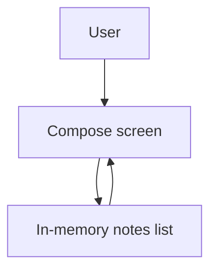

# M2: Baseline App Shell

## Goal

Replace the starter screen with a small Field Notes app shell.

This milestone gives us a real UI to build on before adding Room, repositories, networking, or sync.

## What Changed

- Replaced the default `Hello Android` screen.
- Added a Field Notes screen using Jetpack Compose.
- Added an in-memory list of notes.
- Added a local note editor.
- Added create and edit behavior.
- Added local-only labels to prepare the user for sync status in later milestones.

No database, network, repository, or background sync was added yet.

## Why This Matters For Offline-First Design

Offline-first design is not only about storage and networking. The UI must make local state understandable.

This milestone starts with a simple truth:

The app can already accept local user input without talking to a server.

Later milestones will replace the in-memory list with Room and sync states, but the screen shape will stay familiar.

## Possible Solutions

### Solution 1: Start With Database First

Add Room immediately and build the UI around it.

Advantages:

- Closer to final offline-first architecture.
- Avoids rewriting in-memory state later.
- Teaches local source of truth earlier.

Disadvantages:

- More setup before the UI is visible.
- Harder for beginners to separate UI ideas from persistence ideas.
- More files and generated code in the first implementation milestone.

### Solution 2: Start With UI And In-Memory State

Build the screen first and keep notes only in memory.

Advantages:

- Fast to review.
- Easy to understand.
- Gives later milestones a visible target.
- Keeps Compose state learning separate from database learning.

Disadvantages:

- Notes disappear when the app restarts.
- State is not shared outside the screen.
- This is not offline-first persistence yet.

### Solution 3: Use Static Mock Data Only

Show a list of fake notes but do not allow editing.

Advantages:

- Very simple.
- Useful for pure visual design.

Disadvantages:

- Does not demonstrate local writes.
- Does not prepare well for sync status.
- Less useful as an educational app shell.

Chosen approach: UI with in-memory create and edit behavior.

## Simple Diagram



In this milestone, memory is temporary. In M4, Room will replace it as the source of truth.

## Key Android Best Practices

- Use Compose functions to split the screen into small pieces.
- Keep note state owned by the app screen for this temporary milestone.
- Avoid adding persistence before the UI flow is clear.
- Use immutable note values so updates are explicit.
- Keep the milestone intentionally small.

## Testing Or Verification

Verified with:

```bash
./gradlew testDebugUnitTest
```

Result:

- Build successful.
- Unit test task successful.
- Confirmed the app compiles after replacing the starter screen.

Manual behavior to review:

1. Open the app.
2. See the Field Notes title and one starter note.
3. Type a title and body.
4. Save a local note.
5. Tap a note to edit it.
6. Update the note and see its label change to `Edited locally`.

## Junior Interview Questions

1. What is Jetpack Compose?
2. What does in-memory state mean?
3. Why do notes disappear after the app process is killed in this milestone?
4. What is the difference between a screen and a database?
5. Why is it useful to show a `Local only` label?

## Mid-Level Interview Questions

1. Why should this in-memory state not be treated as the final source of truth?
2. How would `remember` behave during recomposition?
3. What is the difference between `remember` and persistent storage?
4. Why is it useful to model a note as an immutable data class?
5. What problems would happen if networking was added directly inside composables?

## Senior Interview Questions

1. When would you introduce a ViewModel instead of keeping state inside a composable?
2. How would you migrate this screen from in-memory state to Room without changing every UI component?
3. What UI states are missing for a production note editor?
4. How should validation be handled as the app grows?
5. Why is local write feedback important in offline-first systems?

## Architect Interview Questions

1. How does starting with a UI shell reduce risk in a larger offline-first system?
2. What boundaries should exist between UI, domain, local storage, and sync?
3. Which decisions in this milestone are temporary, and which can survive into production?
4. How would the architecture change if notes were shared across multiple devices?
5. How would you explain the difference between temporary UI state and durable local state to a team?
