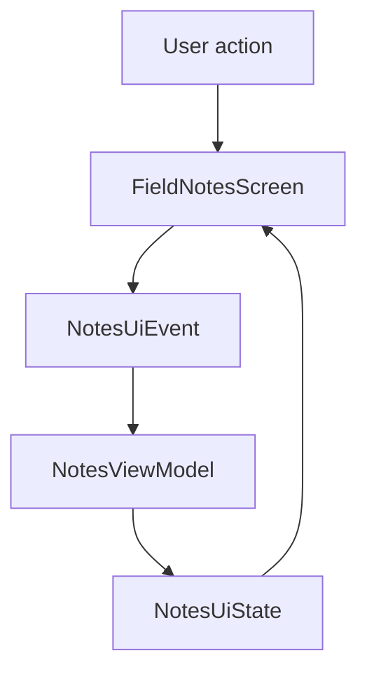

# M3: Architecture Packages And UI State

## Goal

Move note state out of composables and into a ViewModel with clear UI state and UI events.

This milestone prepares the app for Room and repositories without adding persistence yet.

## What Changed

- Added a `domain` package with `FieldNote`.
- Added a `ui.notes` package for the notes feature.
- Added `NotesUiState` as one immutable state object for the screen.
- Added `NotesUiEvent` to model user actions.
- Added `NotesViewModel` to own note state and editor behavior.
- Added `FieldNotesRoute` to connect the ViewModel to Compose.
- Kept `FieldNotesScreen` mostly stateless and previewable.
- Added ViewModel unit tests.

## Why This Matters For Offline-First Design

Offline-first apps need clear boundaries. If screens directly own storage, networking, and sync decisions, the app becomes hard to test and hard to change.

This milestone creates a cleaner flow:

- UI shows state.
- UI sends events.
- ViewModel updates state.
- Later, the ViewModel will call a repository.
- Later, the repository will read from Room and coordinate sync.

## Possible Solutions

### Solution 1: Keep All State In Composables

The screen uses `remember` and updates the note list directly.

Advantages:

- Simple for tiny demos.
- Fewer files.
- Easy to see everything in one place.

Disadvantages:

- Harder to test business behavior.
- State can be lost when the screen leaves composition.
- Persistence and sync logic would crowd the UI.

### Solution 2: Use A ViewModel With UI State

The ViewModel owns state. The screen renders the state and sends events.

Advantages:

- Easier to test.
- Better separation between UI and logic.
- Survives configuration changes.
- Prepares the app for repositories, Room, and sync.

Disadvantages:

- More files.
- More concepts for beginners.
- Can become bloated if domain and data logic are added directly to the ViewModel.

### Solution 3: Introduce Full Clean Architecture Now

Add use cases, repositories, data sources, mappers, and interfaces immediately.

Advantages:

- Strong separation from the beginning.
- Useful for large teams and complex domains.

Disadvantages:

- Too much ceremony for the current app size.
- Harder to learn the offline-first flow step by step.
- May hide simple ideas behind too many layers.

Chosen approach: ViewModel with immutable UI state and UI events.

## Simple Diagram



Later milestones will insert a repository under the ViewModel.

## Key Android Best Practices

- Keep Activity small and focused on app startup.
- Use a ViewModel to own screen state.
- Represent the whole screen with one immutable UI state object.
- Send user actions as explicit events.
- Keep composables previewable by passing state and callbacks.
- Test ViewModel behavior with local unit tests.

## Testing Or Verification

Verified with:

```bash
./gradlew testDebugUnitTest
```

Expected coverage:

- Saving a new note.
- Editing an existing note.
- Ignoring blank note saves.

## Junior Interview Questions

1. What is a ViewModel in Android?
2. Why should an Activity stay small?
3. What is UI state?
4. What is a user event?
5. Why is a previewable composable useful?

## Mid-Level Interview Questions

1. Why is immutable UI state easier to reason about?
2. How does a ViewModel help during configuration changes?
3. What is unidirectional data flow?
4. Why should composables avoid owning business logic?
5. How do UI events make testing easier?

## Senior Interview Questions

1. When does a ViewModel become too large?
2. How would you decide between direct ViewModel logic and use cases?
3. How will this ViewModel change when Room becomes the source of truth?
4. What state should be saved across process death?
5. How would you structure UI events for a more complex editor?

## Architect Interview Questions

1. How do UI state boundaries affect long-term offline-first maintainability?
2. Where should sync orchestration live in a scalable mobile architecture?
3. How would this architecture support multiple screens reading the same local data?
4. What is the difference between screen state, domain state, and persisted state?
5. How would you enforce architecture boundaries across a large Android team?

