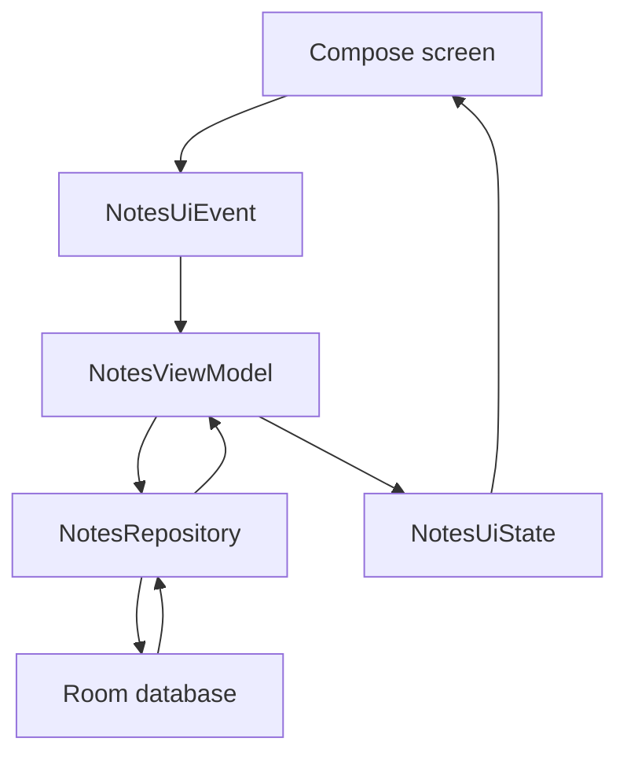

# M4: Local Source Of Truth With Room

## Goal

Make Room the source of truth for notes.

Before this milestone, notes lived in memory. Now the UI observes notes that come from a local database through a repository.

## What Changed

- Added Room dependencies and KSP.
- Added `NoteEntity`, `NoteDao`, and `AppDatabase`.
- Added `RoomNotesRepository`.
- Added `NotesRepository` as the boundary between UI logic and data.
- Updated `NotesViewModel` to observe repository data instead of owning the note list.
- Added a small `AppContainer` to create the database and repository. This was later replaced by Hilt in M16.
- Updated tests to use a fake repository.

## Why This Matters For Offline-First Design

In an offline-first app, the UI should not wait for the network before showing useful data.

The local database becomes the app's source of truth:

- The UI reads local data.
- User changes are saved locally.
- Future sync code will update the local database.
- The network becomes a sync partner, not the direct owner of the screen.

## Possible Solutions

### Solution 1: Keep In-Memory State

Store notes in a ViewModel list.

Advantages:

- Very simple.
- Easy to test.
- Good for early UI demos.

Disadvantages:

- Data is lost when the process dies.
- Other screens cannot reliably share the same data.
- Sync cannot be durable.

### Solution 2: Use SharedPreferences Or DataStore

Store notes as preferences or serialized data.

Advantages:

- Easier setup than Room.
- Useful for small settings or simple key-value data.

Disadvantages:

- Not ideal for lists of records.
- Harder to query, sort, and update individual rows.
- Not a good fit for conflict and sync metadata.

### Solution 3: Use Room

Store notes in a structured SQLite database through Room.

Advantages:

- Durable local storage.
- Works well with Kotlin Flow.
- Good query support.
- Strong fit for offline-first source-of-truth design.
- Easier to add sync status, remote IDs, tombstones, and conflict fields later.

Disadvantages:

- More setup.
- Requires schema and migration thinking.
- Adds generated code through KSP.

Chosen approach: Room.

## Simple Diagram



The screen does not know Room exists. It only sees `NotesUiState`.

Current app note:

The final Notes, Remote, Sync, and Learn screens all still respect the same boundary. Notes reads the local Room-backed source of truth. Remote shows the fake server copy for education, but local app state is still driven by Room.

## Key Android Best Practices

- Keep Room behind a repository interface.
- Let Room expose `Flow` so UI can react to database changes.
- Keep database entities separate from domain models.
- Keep Activity small.
- Test ViewModel behavior with a fake repository.
- Avoid direct database calls from composables.

## Testing Or Verification

Verified with:

```bash
./gradlew testDebugUnitTest
```

Result:

- Build successful.
- Room KSP generation successful.
- ViewModel unit tests successful.

## Junior Interview Questions

1. What is Room?
2. What is a local database?
3. Why is local storage useful when the network is unavailable?
4. What is a DAO?
5. Why should a screen not directly call the database?

## Mid-Level Interview Questions

1. Why is Room a better fit than SharedPreferences for notes?
2. What does "source of truth" mean?
3. Why expose local data as `Flow`?
4. What is the difference between an entity and a domain model?
5. Why use a repository interface?

## Senior Interview Questions

1. How would you design Room entities for future sync metadata?
2. When should Room schema export be enabled?
3. How would you handle database migrations in production?
4. What are risks of putting Room entities directly in UI state?
5. How would you test repository behavior without an Android device?
6. How should Room queries hide tombstones while still letting sync find them?

## Architect Interview Questions

1. Why should offline-first apps treat the local database as the source of truth?
2. How does this design change when multiple local tables must sync together?
3. How would you design data ownership between client storage and backend services?
4. What migration strategy would you require for a large installed user base?
5. How would you support encrypted offline storage?
6. How would you model conflict metadata and pending operations across many entities?
