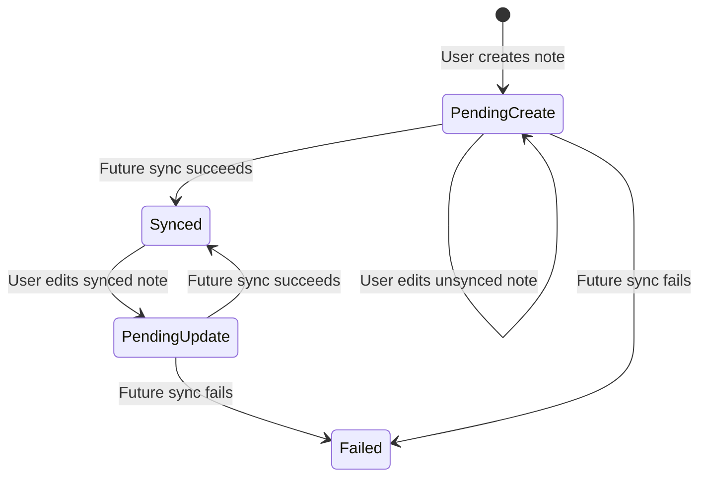

# M5: Local Writes And Sync Status

## Goal

Save user writes locally first and show whether each note still needs sync.

This milestone changes notes from vague local labels to typed sync states.

## What Changed

- Added `SyncStatus`.
- Added `PendingOperation`.
- Updated `FieldNote` to expose sync state.
- Updated Room entities to store sync state and pending operation.
- New notes now become `Pending create`.
- Edited synced notes become `Pending update`.
- Existing unsynced creates stay `Pending create` when edited.
- The UI displays sync status from typed state.

## Why This Matters For Offline-First Design

Offline-first apps should not reject a user's work just because the network is down.

The pattern is:

- Save locally first.
- Mark the record as pending sync.
- Let sync code send the change later.
- Tell the user what is happening.

Without sync status, users cannot tell whether their data is safely stored, waiting to sync, or failed.

Current app note:

The final Notes screen shows the local database list as the main surface. Create and edit happen on a separate editor screen, but the status labels still come from the same typed `SyncStatus` and `PendingOperation` model.

## Possible Solutions

### Solution 1: Hide Sync State

Save locally but do not show any status.

Advantages:

- Cleaner UI.
- Less explanation needed.

Disadvantages:

- Users may not trust the app.
- Failed sync is invisible.
- Harder to debug.

### Solution 2: Show One Generic "Unsynced" State

Use one boolean or label for anything not synced.

Advantages:

- Simple to implement.
- Enough for very small apps.

Disadvantages:

- Cannot tell create, update, and delete apart.
- Sync code needs more detail later.
- Harder to explain failures.

### Solution 3: Track Status And Pending Operation

Store both user-facing status and machine-facing pending operation.

Advantages:

- Clear for users.
- Clear for sync code.
- Prepares for retry, delete, conflict, and failure flows.

Disadvantages:

- More fields.
- More state transitions to test.

Chosen approach: typed sync status plus pending operation.

## Simple Diagram



## Key Android Best Practices

- Use enums for important state instead of plain strings in domain code.
- Persist sync metadata with the record it describes.
- Keep user-facing labels derived from typed state.
- Keep repository methods responsible for choosing local write status.
- Keep UI simple: render state, send events.

## Testing Or Verification

Verified with:

```bash
./gradlew testDebugUnitTest
```

Result:

- Build successful.
- ViewModel tests successful.
- New notes are marked `PendingCreate`.
- Edited synced notes are marked `PendingUpdate`.

## Junior Interview Questions

1. Why should an app save locally before syncing?
2. What does `Pending create` mean?
3. What does `Pending update` mean?
4. Why should users see sync status?
5. What is an enum?

## Mid-Level Interview Questions

1. Why track pending operation separately from display label?
2. Why does editing an unsynced create stay a pending create?
3. What could happen if sync status only lived in memory?
4. How would you show failed sync to a user?
5. Why should repository code decide sync status?

## Senior Interview Questions

1. What state transitions should be allowed for local writes?
2. How would you make sync status idempotent?
3. What happens if the app crashes after a local write but before sync?
4. How would you model pending updates for partially synced records?
5. How would you test sync status transitions?
6. How should status labels behave while auto sync is queued but not finished?

## Architect Interview Questions

1. How does pending operation modeling affect backend API design?
2. What metadata would you add for enterprise-grade offline sync?
3. How would you handle multiple edits before the first sync succeeds?
4. How would the model change for collaborative multi-device editing?
5. What user experience principles should guide visible sync status?
6. How would you design sync status for a multi-entity app with notes, attachments, and comments?
