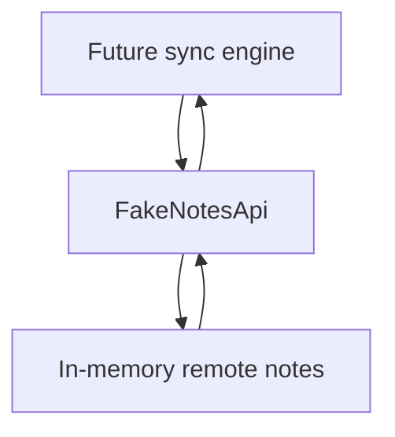

# M6: Fake Remote API

## Goal

Add a remote data source without depending on real internet or a backend server.

This milestone creates a fake API that behaves enough like a remote service to teach sync.

## What Changed

- Added `RemoteNote`.
- Added `FakeNotesApi`.
- Added `InMemoryFakeNotesApi`.
- Added fake network delay support.
- Added one-shot fake failure support.
- Added unit tests for create, update, list, and failure behavior.

The UI still reads from Room. Full sync starts in M7.

## Why This Matters For Offline-First Design

Offline-first sync needs two sides:

- Local source of truth.
- Remote exchange partner.

A fake API lets us practice the remote side safely:

- No server setup.
- No real network flakiness.
- Deterministic tests.
- Easy failure simulation.

## Possible Solutions

### Solution 1: Use A Real Backend Immediately

Build or connect to a real API server.

Advantages:

- Closest to production.
- Teaches real HTTP and deployment concerns.

Disadvantages:

- Slower to set up.
- More moving parts.
- Harder to make deterministic for learning.

### Solution 2: Use A Mock Web Server

Use a local HTTP mock server.

Advantages:

- Teaches HTTP behavior.
- Good for networking tests.
- More realistic than direct in-memory calls.

Disadvantages:

- Still adds HTTP setup.
- More complexity before sync logic is understood.

### Solution 3: Use An In-Memory Fake API

Create a Kotlin interface and fake implementation.

Advantages:

- Very fast.
- Easy to test.
- Easy to simulate failures.
- Lets us focus on sync concepts first.

Disadvantages:

- Does not teach HTTP details yet.
- Not a full backend contract.
- State resets when the app process restarts.

Chosen approach: in-memory fake API.

## Simple Diagram



M7 will connect Room and this fake API through manual sync.

## Key Android Best Practices

- Depend on an interface, not a concrete fake.
- Keep remote DTOs separate from local entities.
- Make failures easy to simulate.
- Test fake behavior before using it in sync logic.
- Avoid putting fake remote state in the UI layer.

## Testing Or Verification

Verified with:

```bash
./gradlew testDebugUnitTest
```

Result:

- Build successful.
- Fake API unit tests successful.

## Junior Interview Questions

1. What is a fake API?
2. Why not use a real backend right away?
3. What is a remote DTO?
4. Why simulate network failure?
5. What does deterministic test mean?

## Mid-Level Interview Questions

1. Why should the fake API use an interface?
2. What behavior should a fake API include for sync testing?
3. What is the difference between a fake API and a mock server?
4. Why keep remote models separate from Room entities?
5. How can fake delay help test loading states?

## Senior Interview Questions

1. What production problems can an in-memory fake hide?
2. How would you evolve this fake into a Retrofit service?
3. Which sync bugs can be caught with a fake API?
4. Which sync bugs require real networking tests?
5. How should fake failures be designed for useful tests?

## Architect Interview Questions

1. When should teams invest in a local mock server?
2. How do fake services support mobile architecture reviews?
3. What backend guarantees does offline sync need?
4. How would you version remote DTOs over time?
5. How would you design contract tests between mobile and backend teams?

