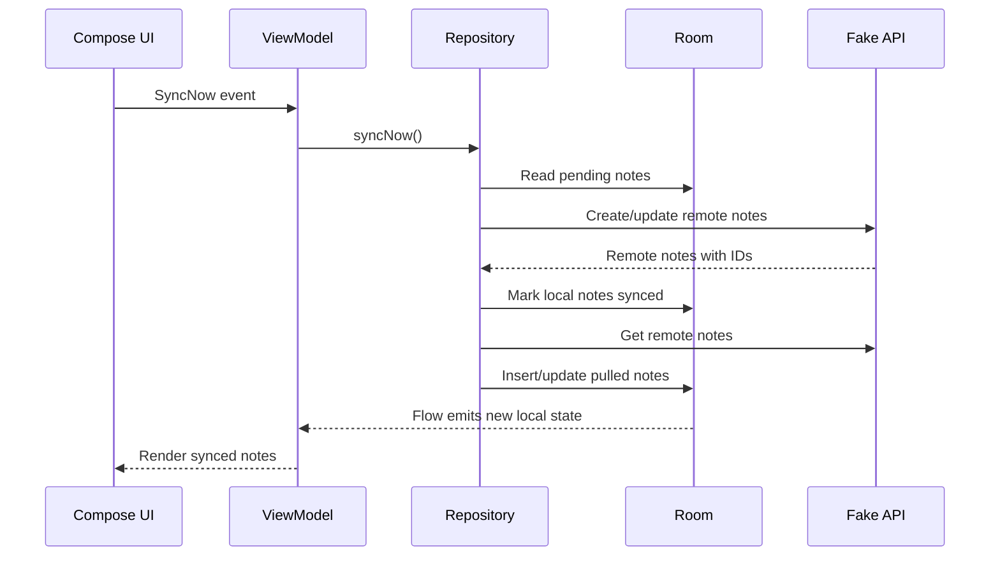

# M7: Manual Sync

## Goal

Let the user manually sync pending local changes with the fake remote API.

This is the first milestone where local Room data and remote fake API data exchange changes.

## What Changed

- Added `SyncResult`.
- Added `syncNow()` to `NotesRepository`.
- Added DAO queries for pending notes and remote ID lookup.
- Added a unique Room index for `remoteId`.
- Added manual sync UI.
- Added sync state to `NotesUiState`.
- Added `SyncNow` as a UI event.
- Sync now pushes pending creates and updates.
- Sync now pulls remote notes back into Room.
- Successful sync marks notes as `Synced`.
- Failed push attempts mark notes as `Failed`.

## Why This Matters For Offline-First Design

Manual sync makes the offline-first flow visible:

1. User writes locally.
2. Local record is marked pending.
3. User taps sync.
4. App sends pending changes to the remote API.
5. App updates Room with remote IDs and synced status.
6. UI updates from Room.

The UI still does not read from the remote API directly.

## Possible Solutions

### Solution 1: Pull First, Then Push

Fetch remote changes before sending local changes.

Advantages:

- Can detect remote changes before local upload.
- Useful when conflict detection is already mature.

Disadvantages:

- More complicated before conflict handling exists.
- Local user changes may wait longer.

### Solution 2: Push First, Then Pull

Send local pending operations first, then fetch remote state.

Advantages:

- Local user work is prioritized.
- Easier to understand.
- Good for this milestone before conflict handling.

Disadvantages:

- Conflicts are not fully handled yet.
- Remote changes may be applied after local push.

### Solution 3: Bidirectional Merge Engine

Use a full sync algorithm that compares local and remote versions together.

Advantages:

- More production-ready.
- Better for complex conflict handling.

Disadvantages:

- Too much complexity for the first sync milestone.
- Harder to teach one concept at a time.

Chosen approach: push pending local changes first, then pull remote notes.

## Simple Diagram



## Key Android Best Practices

- Keep sync orchestration out of composables.
- Keep UI reading local state, not remote state.
- Store remote IDs locally after successful create.
- Treat sync as a repository/data-layer concern.
- Surface sync result to the user.
- Keep failure states visible.

## Testing Or Verification

Verified with:

```bash
./gradlew testDebugUnitTest
```

Result:

- Build successful.
- ViewModel sync test successful.
- Fake API tests still successful.

## Junior Interview Questions

1. What happens when the user taps `Sync now`?
2. Why does the app store a remote ID?
3. What does `Synced` mean?
4. Why does the UI still read from Room?
5. What does push mean in sync?

## Mid-Level Interview Questions

1. Why push pending changes before pulling remote data in this milestone?
2. What can go wrong if a create request succeeds but the app crashes before saving the remote ID?
3. Why should failed sync keep the local note?
4. What is idempotency?
5. Why does sync return a result object?

## Senior Interview Questions

1. How would you make remote create idempotent?
2. How would you avoid duplicate remote notes after retries?
3. What race conditions can happen during manual sync?
4. How should sync behave if the user edits a note while sync is running?
5. What repository tests would you add around push and pull?

## Architect Interview Questions

1. What backend API guarantees are required for reliable offline sync?
2. How would you design sync for multiple entity types?
3. How would you handle partial sync failure?
4. What observability would you require for production sync?
5. How would you explain push, pull, and merge to a product team?

