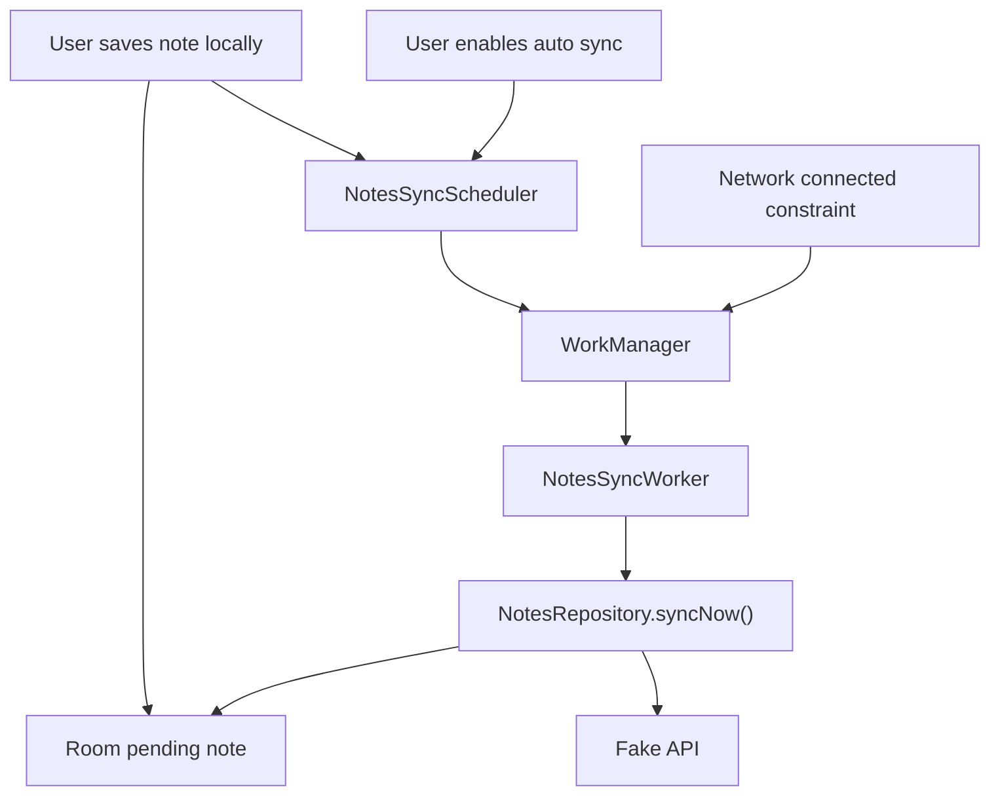

# M8: Background Sync With WorkManager

## Goal

Run sync reliably outside the visible screen.

This milestone adds WorkManager so local writes can request background sync when network is available.

## What Changed

- Added WorkManager dependency.
- Added `NotesSyncWorker`.
- Added `NotesSyncScheduler`.
- Added network constraint for background sync.
- Added exponential backoff.
- Local saves now enqueue one-time background sync.
- Turning on auto sync now queues existing syncable pending notes.
- Manual sync still exists.
- Added unit tests proving local save and enabling auto sync schedule background sync.

## Why This Matters For Offline-First Design

Users should not need to stare at the app and tap sync every time.

WorkManager helps because it can:

- Run work after the screen closes.
- Wait for network.
- Retry after failure.
- Survive process death better than a plain coroutine.

The important design choice: WorkManager calls the same repository `syncNow()` method as manual sync.

This app uses one-time constrained work, not periodic work. That means auto sync is triggered by app events, such as saving a note or enabling auto sync with pending work. WorkManager then waits until the network constraint is satisfied.

## Possible Solutions

### Solution 1: Launch A Coroutine From The ViewModel

Start sync in `viewModelScope`.

Advantages:

- Simple.
- Good for immediate foreground work.

Disadvantages:

- Stops when ViewModel is cleared.
- Not durable enough for background sync.
- Cannot express OS-managed constraints.

### Solution 2: Use A Foreground Service

Run sync in a visible service.

Advantages:

- Useful for long-running user-visible work.
- More control over execution.

Disadvantages:

- Too heavy for small note sync.
- Requires notification UX.
- More battery and policy concerns.

### Solution 3: Use WorkManager

Schedule constrained, retryable background work.

Advantages:

- Built for deferrable background work.
- Supports network constraints.
- Supports retry and backoff.
- Works well for offline-first sync.

Disadvantages:

- Not instant.
- OS still controls exact timing.
- Needs careful worker design.

Chosen approach: WorkManager.

## Current Auto Sync Behavior

Auto sync in this demo means:

1. A local write is saved to Room.
2. The ViewModel asks `NotesSyncScheduler` to enqueue one-time work.
3. WorkManager keeps only one unique sync job with `ExistingWorkPolicy.KEEP`.
4. The job requires `NetworkType.CONNECTED`.
5. If the phone is offline, Android waits until the constraint is met.
6. `NotesSyncWorker` calls `NotesRepository.syncNow()`.

When the user turns auto sync on, the ViewModel also checks for existing pending notes. If syncable pending notes already exist, it queues work immediately.

Conflict notes are different. They are not syncable until the user resolves the conflict, because pushing them automatically could hide a product decision.

## Simple Diagram



## Key Android Best Practices

- Use WorkManager for deferrable background sync.
- Add network constraints instead of manually polling network state.
- Use exponential backoff for retry.
- Keep worker code small.
- Reuse repository sync logic instead of duplicating sync inside the worker.
- Use unique work to avoid stacking duplicate sync jobs.
- Do not treat WorkManager as an instant network-change callback. Android decides exactly when eligible work runs.

## Testing Or Verification

Verified with:

```bash
./gradlew testDebugUnitTest
```

Result:

- Build successful.
- ViewModel scheduling test successful.
- Existing sync tests successful.

## Junior Interview Questions

1. What is WorkManager?
2. Why is a coroutine not enough for background sync?
3. What does a network constraint mean?
4. What is retry?
5. Why should local save happen before background sync?
6. Is this app's auto sync time based or network-constraint based?

## Mid-Level Interview Questions

1. Why use unique work for sync?
2. What is exponential backoff?
3. Why should the worker call repository sync instead of owning sync logic?
4. When is WorkManager not the right tool?
5. What happens if network is unavailable when work is scheduled?
6. Why should enabling auto sync queue existing pending work?

## Senior Interview Questions

1. How would you test a WorkManager worker?
2. How should sync jobs be cancelled or replaced?
3. What are the risks of scheduling sync after every local write?
4. How would you batch pending operations?
5. How would worker retry interact with server-side idempotency?
6. Why should conflict records wait for user resolution before auto sync?

## Architect Interview Questions

1. How would you design background sync for battery efficiency at scale?
2. What work should be immediate versus deferred?
3. How would you coordinate sync across multiple app modules?
4. How would you monitor background sync success in production?
5. How would platform limits change your sync strategy?
6. When would you choose periodic sync instead of event-triggered one-time sync?
