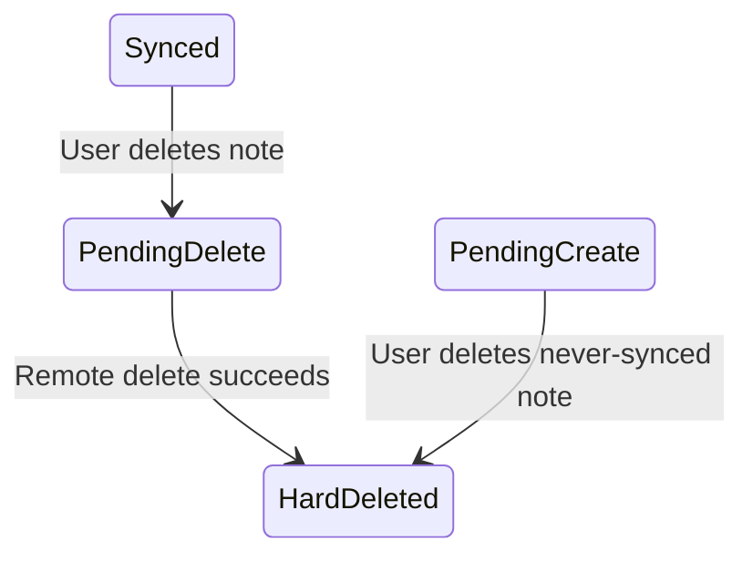

# M9: Delete And Tombstones

## Goal

Handle deletes safely in an offline-first system.

This milestone adds delete support while keeping enough local metadata to sync remote deletes later.

## What Changed

- Added `PendingOperation.Delete`.
- Added `SyncStatus.PendingDelete`.
- Added `isDeleted` to local Room notes.
- Visible note queries now hide deleted tombstones.
- Never-synced local notes are hard-deleted immediately.
- Synced notes become hidden tombstones until sync deletes them remotely.
- Fake API now supports delete.
- Manual/background sync can push remote deletes.
- Added delete UI.
- Current UI asks for confirmation before deleting a note.
- Added delete tests.

## Why This Matters For Offline-First Design

Deletes are harder than creates and updates because the app must remember what to delete remotely.

If a synced note is removed from the local database immediately while offline, the app forgets which remote record should be deleted later.

A tombstone solves that:

- Hide the note from the user.
- Keep remote ID and pending delete metadata.
- Sync the delete later.
- Hard-delete locally after remote delete succeeds.

## Possible Solutions

### Solution 1: Hard Delete Immediately

Remove the row from Room as soon as the user taps delete.

Advantages:

- Simple.
- The UI updates immediately.

Disadvantages:

- Loses remote ID for synced notes.
- Cannot sync remote delete later if offline.
- Can resurrect deleted data on the next pull.

### Solution 2: Soft Delete Forever

Mark rows as deleted and never remove them.

Advantages:

- Preserves audit history.
- Easy to sync later.

Disadvantages:

- Database grows forever.
- Queries must always filter deleted rows.
- Requires cleanup policy.

### Solution 3: Tombstone Until Sync

Hide deleted rows locally, sync delete remotely, then hard-delete locally.

Advantages:

- Good balance for mobile sync.
- Keeps metadata only as long as needed.
- Avoids accidental resurrection.

Disadvantages:

- More state to manage.
- Needs sync cleanup.

Chosen approach: tombstone until sync for synced notes; immediate hard delete for never-synced local creates.

Current app note:

The final UI asks the user to confirm before delete. Confirmation is a UI safety step. Tombstones are the data-layer safety step. Both matter: confirmation prevents accidental user action, while tombstones prevent losing the remote ID needed for later sync.

## Simple Diagram



## Key Android Best Practices

- Do not lose remote IDs before sync completes.
- Hide tombstones from normal UI queries.
- Keep delete sync in the repository/data layer.
- Treat never-synced local records differently from synced records.
- Test delete behavior through the same UI event path as other writes.
- Ask for confirmation before destructive UI actions.

## Testing Or Verification

Verified with:

```bash
./gradlew testDebugUnitTest
```

Result:

- Build successful.
- Fake API delete test successful.
- ViewModel delete test successful.
- Existing sync tests successful.

## Junior Interview Questions

1. Why is deleting offline harder than editing offline?
2. What is a tombstone?
3. Why hide deleted notes from the UI?
4. What is a hard delete?
5. Why does the app keep the remote ID after delete?

## Mid-Level Interview Questions

1. Why can immediate hard delete cause remote data to come back?
2. When is it safe to hard-delete a local note immediately?
3. How does pending delete sync work?
4. Why should tombstones be filtered in DAO queries?
5. How would you show delete sync failure to users?

## Senior Interview Questions

1. How would you handle delete retry after app restart?
2. What happens if the remote record is already deleted?
3. How should delete operations be made idempotent?
4. How would you handle undo after local delete?
5. What cleanup policy would you use for old tombstones?
6. Why is delete confirmation not a replacement for tombstones?

## Architect Interview Questions

1. How should backend APIs represent deletes for offline clients?
2. When should tombstones exist on the server too?
3. How do tombstones affect pull sync and conflict handling?
4. What compliance or audit requirements might change delete behavior?
5. How would delete sync work across multiple user devices?
6. How would you design delete confirmation, undo, audit, and sync cleanup together?
