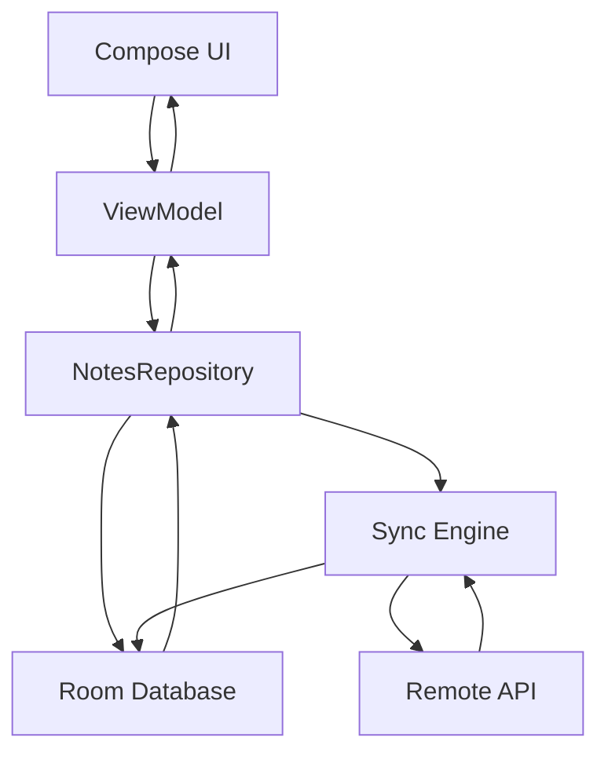

# Offline First Android Demo Roadmap

This roadmap breaks the project into small milestones. Each milestone should be implemented, documented, verified, committed, and then paused for review.

Repository note: Git was initialized after the first planning step so milestones can be committed one by one.

## Milestone Rules

For every implementation milestone:

1. Keep the change small and reviewable.
2. Add or update `docs/learning/mN-milestone-name.md`.
3. Explain possible approaches in simple English.
4. Include advantages and disadvantages.
5. Include at least one simple diagram.
6. Include interview questions for junior, mid-level, senior, and architect levels.
7. Run relevant tests or Gradle checks when possible.
8. Create one Git commit for the milestone after reviewable work is complete.
9. Stop and wait for user review.

## Proposed App Theme

Build a small "Field Notes" app.

Users can create, edit, and sync notes while moving between online and offline states. This domain is simple enough for learning, but rich enough to demonstrate local-first reads, offline writes, background sync, retries, conflict handling, and observability.

Example note fields:

- Title
- Body
- Last edited time
- Sync status
- Remote ID
- Local pending operation

## Solution Options At A Glance

### Option 1: Network-First App

The UI calls the API directly and stores little or no local data.

Advantages:

- Simple to build at first.
- Fewer local data problems.
- Good when the app is useless without fresh server data.

Disadvantages:

- Poor offline experience.
- Screens break or become empty when network fails.
- Harder to support pending local writes.

### Option 2: Cache-Aside App

The app fetches from network and keeps a local cache for faster reads.

Advantages:

- Better startup and repeat loading.
- Some data can still be shown offline.
- Easier than full offline-first sync.

Disadvantages:

- Often treats offline as a fallback, not the main design.
- User writes may still fail immediately when offline.
- Cache invalidation can become confusing.

### Option 3: Offline-First App

The UI reads from a local database. User writes go to the database first. Sync code later exchanges changes with the server.

Advantages:

- Best user experience during unreliable network.
- Clear local source of truth.
- Works well with background sync and retry.
- Scales into real system design topics.

Disadvantages:

- More moving parts.
- Requires careful sync state modeling.
- Conflict handling must be designed, not ignored.

Chosen direction: Option 3, offline-first with a local database as the source of truth.

## Simple Target Architecture



The important idea: the UI observes local data. The network updates local data through sync.

## Micro Milestones

### M1: Document Requirements And Roadmap

Files:

- `agent.md`
- `roadmap.md`
- `docs/learning/m1-document-requirements-and-roadmap.md`

Learning goal:

- Define the project contract and explain what offline-first means before writing code.

Expected implementation:

- Documentation only.

Commit:

```text
m1: document roadmap and agent requirements
```

Status:

- Ready for commit after `agent.md`, `roadmap.md`, and the M1 learning doc are added.

### M2: Baseline App Shell

Learning goal:

- Create a clean Compose screen structure for a notes app without persistence yet.

Expected implementation:

- App scaffold.
- Notes list screen.
- Empty state.
- Add/edit note UI with in-memory state only.

Learning topics:

- Compose state basics.
- UI state vs business state.
- Why an app shell should be separated from data decisions.

Status:

- Implemented with an in-memory Compose Field Notes shell.
- Verified with `./gradlew testDebugUnitTest`.

### M3: Architecture Packages And UI State

Learning goal:

- Introduce a maintainable package structure and ViewModel-driven UI state.

Expected implementation:

- `ui`, `domain`, `data` package structure.
- ViewModel with immutable UI state.
- UI events modeled clearly.

Learning topics:

- MVVM.
- Unidirectional data flow.
- State holders.
- Why screens should not know storage details.

Status:

- Implemented with `domain`, `ui.notes`, immutable UI state, UI events, and a `NotesViewModel`.
- Verified with `./gradlew testDebugUnitTest`.

### M4: Local Source Of Truth With Room

Learning goal:

- Make Room the source of truth for notes.

Expected implementation:

- Room entity.
- DAO.
- Database.
- Repository reads notes from Room as `Flow`.
- UI observes database-backed state.

Learning topics:

- Local-first reads.
- Entities vs domain models.
- Flow from Room.
- Why local storage is central to offline-first design.

Status:

- Implemented Room as the local source of truth behind `NotesRepository`.
- Verified with `./gradlew testDebugUnitTest`.

### M5: Local Writes And Sync Status

Learning goal:

- Save user writes locally first and show whether each note is synced.

Expected implementation:

- Add sync status fields.
- Create and edit notes while offline.
- Show statuses such as `Pending Create`, `Pending Update`, `Synced`, and `Failed`.

Learning topics:

- Optimistic writes.
- Pending operations.
- User trust and visible sync state.

Status:

- Implemented typed sync status and pending operation metadata.
- Verified with `./gradlew testDebugUnitTest`.

### M6: Fake Remote API

Learning goal:

- Add a simple remote source without making the app depend on real internet.

Expected implementation:

- Fake API interface.
- Fake network delay and failures.
- Repository or sync component can call the fake API.

Learning topics:

- Remote data source abstraction.
- Why fake APIs are useful for learning and tests.
- Network-first vs database-first control flow.

Status:

- Implemented an in-memory fake notes API with delay and failure simulation.
- Verified with `./gradlew testDebugUnitTest`.

### M7: Manual Sync

Learning goal:

- Push pending local changes to the fake remote source and pull remote changes back into Room.

Expected implementation:

- Sync button.
- Push pending creates and updates.
- Pull remote notes.
- Update local sync statuses.

Learning topics:

- Sync loop basics.
- Idempotency.
- Mapping local IDs to remote IDs.
- Failure handling.

### M8: Background Sync With WorkManager

Learning goal:

- Run sync reliably outside the visible screen.

Expected implementation:

- WorkManager sync worker.
- Network constraints.
- Retry policy.
- Manual trigger plus background trigger.

Learning topics:

- WorkManager.
- Backoff.
- Constraints.
- Why background sync is not just a coroutine.

### M9: Delete And Tombstones

Learning goal:

- Handle deletes safely in an offline-first system.

Expected implementation:

- Local delete operation.
- Tombstone state for pending remote delete.
- Sync delete to remote.
- Hide or display deleted items deliberately.

Learning topics:

- Why deletes are harder offline.
- Tombstones.
- Soft delete vs hard delete.

### M10: Conflict Detection

Learning goal:

- Show what happens when local and remote versions both change.

Expected implementation:

- Version or timestamp fields.
- Conflict state.
- Demo conflict scenario.

Learning topics:

- Last-write-wins.
- Manual merge.
- Server-authoritative conflict resolution.
- Client-authoritative conflict resolution.

### M11: Conflict Resolution UI

Learning goal:

- Let users understand and resolve conflicts.

Expected implementation:

- Conflict screen or dialog.
- Choose local version, remote version, or merged version.
- Save resolved note and sync again.

Learning topics:

- Human-centered conflict handling.
- Data loss risks.
- Product choices in system design.

### M12: Connectivity Awareness

Learning goal:

- Display network availability without making connectivity the only source of truth.

Expected implementation:

- Connectivity observer.
- Online/offline indicator.
- Sync behavior that reacts to connectivity changes.

Learning topics:

- Connectivity is a hint, not a guarantee.
- Captive portals and flaky networks.
- Why all network calls still need error handling.

### M13: Testing Offline-First Behavior

Learning goal:

- Prove important offline-first behavior with tests.

Expected implementation:

- DAO tests.
- Repository tests.
- Sync tests with fake API.
- Failure and retry tests where practical.

Learning topics:

- Testing with fakes.
- Deterministic sync tests.
- What should and should not be tested on Android device/emulator.

### M14: Observability And Debug Tools

Learning goal:

- Make sync behavior easier to inspect while learning.

Expected implementation:

- Debug sync log screen.
- Last sync result.
- Last sync time.
- Error messages suitable for education.

Learning topics:

- Observability.
- Debugging offline systems.
- Logs vs user-facing status.

### M15: Final Polish And Architecture Review

Learning goal:

- Review the complete app as a system design case study.

Expected implementation:

- Clean up naming and UI.
- Review docs.
- Final architecture diagram.
- Final interview question bank.

Learning topics:

- Offline-first tradeoffs.
- Mobile system design.
- Scaling from demo to production.

## Suggested Learning Doc Naming

- `docs/learning/m1-document-requirements-and-roadmap.md`
- `docs/learning/m2-baseline-app-shell.md`
- `docs/learning/m3-architecture-packages-and-ui-state.md`
- `docs/learning/m4-local-source-of-truth-with-room.md`
- `docs/learning/m5-local-writes-and-sync-status.md`
- `docs/learning/m6-fake-remote-api.md`
- `docs/learning/m7-manual-sync.md`
- `docs/learning/m8-background-sync-with-workmanager.md`
- `docs/learning/m9-delete-and-tombstones.md`
- `docs/learning/m10-conflict-detection.md`
- `docs/learning/m11-conflict-resolution-ui.md`
- `docs/learning/m12-connectivity-awareness.md`
- `docs/learning/m13-testing-offline-first-behavior.md`
- `docs/learning/m14-observability-and-debug-tools.md`
- `docs/learning/m15-final-polish-and-architecture-review.md`

## Git Setup

The user requested one commit per micro milestone. Use this pattern:

```bash
git add .
git commit -m "mN: short milestone name"
```

Use the local Git identity requested by the user:

```bash
git config user.name "venkataramk"
```
